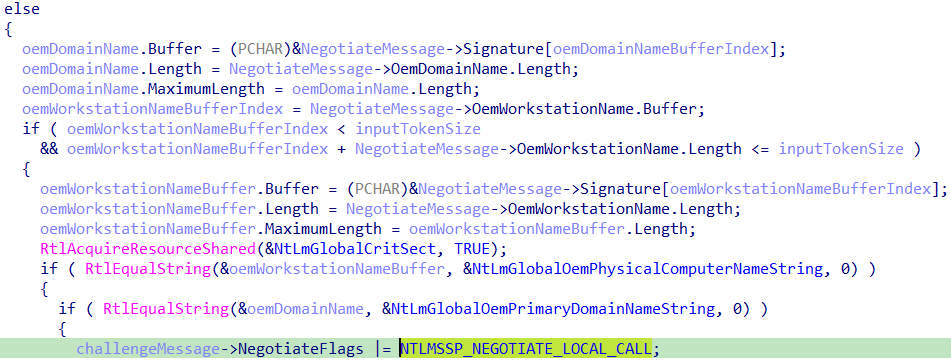
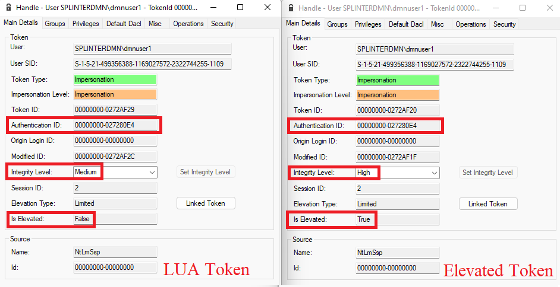
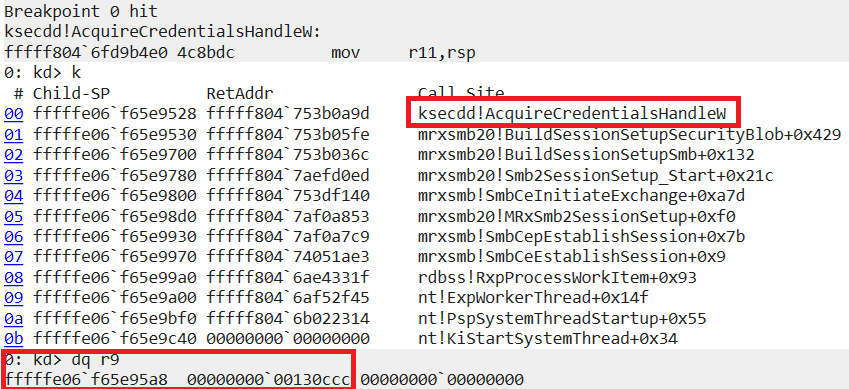

UAC：用户账户控制（以前称为 LUA - 受限用户账户）
---------------------------------------------------------------

简单提供一些背景知识，[UAC（用户账户控制）](https://learn.microsoft.com/en-us/windows/security/application-security/application-control/user-account-control/)是 Windows 中的一种提权机制，当某个操作需要管理权限时，它会触发一个同意提示。这个同意提示旨在通过要求管理员批准来强制实行**权限分离**。虽然它为防止未经授权的操作系统更改增加一层安全保障，但事实证明它的设计充满了漏洞。有很多已知的方法可以绕过 UAC，并在没有用户交互提供的任何提示或同意的情况下以提升的权限执行操作。你可以参考[UACMe](https://github.com/hfiref0x/UACME)，以获取已知 UAC 绕过方法（已修复和未修复的🙈）的整理列表和相关源代码。

我打赌你在某个时候遇到过这个屏幕。是的，这就是 UAC 同意提示：

  

如果对 UAC 的内部工作原理感兴趣，已经有很多关于它的研究。在参考部分可以找到一些全面的演讲和博客文章。

NTLM 身份验证中的一个有趣行为
-----------------------------------------------

在 Windows 中存在“type your password once and authenticate everywhere”的奇妙概念。这与任何单点登录系统的基本概念相同，但直接集成到操作系统中。为了实现这一点，必须有人存储你的密码，这就是[**LSA**](https://learn.microsoft.com/en-us/windows/win32/secauthn/lsa-authentication)发挥作用的地方。它为系统上发生的任何相关身份验证提供了支撑。需要知道的是，LSA（在**lsass.exe**中实现）通过使用存储在注册表中的配置信息加载**身份验证包**DLL。加载多个身份验证包允许 LSA 支持多种安全协议，例如[NTLM](https://learn.microsoft.com/en-us/windows/win32/secauthn/msv1-0-authentication-package)、[Kerberos](https://learn.microsoft.com/en-us/windows/win32/secauthn/kerberos-ssp-ap)等等。

当你交互式登录时，LSA 会创建一个新的**登录会话**，将其与你的凭据相关联，并为你的进程创建一个**令牌**，该令牌引用这个新创建的登录会话。这样，当你的进程尝试访问远程资源，比如`\\\\SHARE-SERVER\\share1\\file.txt` 时，你的进程可以调用[SSPI 函数](https://learn.microsoft.com/en-us/windows/win32/secauthn/authentication-functions#context-management)来检索**安全缓冲区**以便通过网络发送，并且身份验证从应用程序逻辑中抽象出来，无需提供显式凭据。实际发生的情况是，当你的应用程序调用 SSPI 函数时，它与 lsass.exe 进行通信，lsass.exe 反过来会检查你的进程（如果正在模拟，则检查线程）令牌，并能够关联你的正确**凭据**并派生你的进程可用于身份验证的适当身份验证缓冲区。这是一个过于简化的解释，但希望读者能明白要点。具体的可以参考微软的[介绍](https://learn.microsoft.com/zh-cn/windows-server/security/windows-authentication/credentials-processes-in-windows-authentication)：

当**网络身份验证**发生时，UAC 限制不会影响生成的令牌。但是有两个例外情况：

*   如果你使用**共享的本地管理员**帐户（内置管理员帐户除外）对远程机器进行身份验证；
*   如果你在不使用 SPPI 的情况下进行**回环(loopback) 身份验证**并使用本地管理员用户。你需要知道用户的密码或至少是用户的哈希值。

​		只有在这些情况下，[UAC 远程限制](https://learn.microsoft.com/en-us/troubleshoot/windows-server/windows-security/user-account-control-and-remote-restriction#how-uac-remote-restrictions-work)才会生效。如果将 LocalAccountTokenFilterPolicy 设置为 0（这是默认配置），这些限制也将限制服务器端由网络身份验证生成的令牌。相反，如果你使用一个同时也是机器管理员的域用户，UAC 就不会成为障碍：

可以参考[UAC 对域用户的远程限制](https://learn.microsoft.com/en-us/troubleshoot/windows-server/windows-security/user-account-control-and-remote-restriction#how-uac-remote-restrictions-work)。

​		阻止任何人通过 SSPI 在本地绕过 UAC 的主要机制是本地身份验证(**Local Authentication**)。为了理解它，让我们从等式中去掉使用 Kerberos 的本地身份验证，专注于**NTLM**。（注意：[James Forshaw](https://twitter.com/tiraniddo)已经在这篇[博客文章](https://www.tiraniddo.dev/2022/03/bypassing-uac-in-most-complex-way.html)中展示了如何在本地绕过 Kerberos 上的 UAC 限制。）

如果你熟悉 NTLM 身份验证，你可以通过观察消息交换中的下面细节来识别[本地身份验证](https://davenport.sourceforge.net/ntlm.html#localAuthentication)：

*   服务器在挑战消息（类型 2）中设置“**协商本地调用**”标志，NTLM_NEGOTIATE、Negotiate Local Call；
*   挑战消息中的“**保留**”字段不为 0，并包含一个引用服务器上下文句柄的数字；
*   客户端生成的身份验证消息（类型 3）包含**空**安全缓冲区；

当这种情况发生时，LSASS 能够将调用进程的**实际令牌**与服务器应用程序的安全上下文相关联。结果，客户端上的任何 UAC 限制对服务器应用程序都变得可见。

让我们看看在通过 SSPI 进行本地与远程 NTLM 身份验证时令牌的差异：

[System Informer](https://systeminformer.sourceforge.io/)中本地身份验证（左）与远程身份验证（右）的令牌视图。本地身份验证返回的令牌具有 UAC 限制，实际上你可以看到**IL 级别**是**中等**，并且**管理员**SID 是**禁用**的。相反，远程身份验证在没有 UAC 限制的情况下进行，生成的提升令牌设置为**高 IL**。这里一个重要的区别是令牌中存在的[登录类型 SID](https://learn.microsoft.com/en-us/windows/win32/secauthz/well-known-sids)，在经过筛选的令牌中有 INTERACTIVE SID，而在提升的令牌中有 NETWORK SID。

**所以问题是：我们能否通过 SSPI 在本地用 NTLM 伪造网络身份验证？**

意外的位标志
-----------------------

如果我们想在本地身份验证期间欺骗 LSASS，首先我们需要了解这个结果在代码中何时以及如何做出。逆向[msv1_0.dll](https://learn.microsoft.com/en-us/windows/win32/secauthn/msv1-0-authentication-package)并搜索设置标志 0x4000（NTLMSSP_NEGOTIATE_LOCAL_CALL）的函数：

毫无意外，我们找到了函数 SsprHandleNegotiateMessage。这个函数的作用是处理客户端收到的协商消息并生成适当的挑战。从代码的角度来看，我们在服务器对[AcceptSecurityContext](https://learn.microsoft.com/en-us/windows/win32/secauthn/acceptsecuritycontext--ntlm)的第一次调用中到达这里。

这个代码用于检测本地身份验证的逻辑非常直接：如果客户端在**协商**消息中提供的域名和机器名与本地机器名和域名匹配，那么这就是一个本地身份验证的情况。

但是我们如何进入代码的这一部分呢？让我们交叉引用上面的那个 if 分支：

所以这个函数正在检查客户端提供的协商标志，特别是检查 **NTLMSSP_NEGOTIATE_OEM_WORKSTATION_SUPPLIED** 和 **NTLMSSP_NEGOTIATE_OEM_DOMAIN_SUPPLIED** 是否设置，如果你在最新的 Windows 版本中使用 SSPI，这总是为真。

然而，另一个被检查的标志 NTLMSSP_NEGOTIATE_DATAGRAM 到底是什么呢？在网上搜索让我找到了[数据报上下文](https://learn.microsoft.com/en-us/windows/win32/secauthn/datagram-contexts)。
我仍然不明白这个功能的预期行为用途是什么，但我只需要知道我可以通过在第一次[InitializeSecurityContext](https://learn.microsoft.com/en-us/windows/win32/secauthn/initializesecuritycontext--ntlm)客户端调用中使用标志 ISC_REQ_DATAGRAM 从客户端设置这个“模式”。希望通过这样做，我能够强制实现我所期望的网络身份验证。

唯一需要考虑的是，该模式使用**无连接上下文语义**（**connection-less context semantics**），并且与外部服务同步可能会有问题。但是对于我们的情况，我们可以在**同一进程**中运行服务器和客户端。即使这听起来很奇怪，但这正是我们需要的最终我们只需要**欺骗**LSASS 为我们**伪造**令牌。

让我们整理所有的代码，并检查在使用**数据报上下文**时生成的安全缓冲区的样子：

观察交换的安全缓冲区，我们可以看到“协商本地标志”（“**Negotiate Local Flag**” ）未设置，并且“**Reserved**”字节为 0，因此服务器没有传递上下文句柄。此外，客户端还在身份验证消息中发送了 NTLMv2 响应。它看起来绝对像是客户端和服务器没有在协商本地身份验证。
请注意，在[数据报样式身份验证](https://davenport.sourceforge.net/ntlm.html#datagramAuthentication)中生成的协商消息（类型 1）是空的，这与“正常”的面向连接的身份验证相比是一个重要的区别。

让我们检查这个身份验证生成的令牌，特别是它是否包含神奇的 NETWORK SID 登录类型：

好消息是，NETWORK SID 已经添加到我们的令牌中，所以任务完成。

但是，令牌被 UAC 过滤了。如图所示，令牌的 IL 是中等，甚至不是提升的。我认为本地身份验证是过滤令牌的唯一机制的假设是错误的。可能，LSASS 还有其他检查措施，暂时先放放。

共享登录会话
-------------------------------------------------

我看到了[James Forshaw](https://twitter.com/tiraniddo)的博客文章“[共享登录会话有点过头了](https://www.tiraniddo.dev/2020/04/sharing-logon-session-little-too-much.html)”，它启发了我一条**不同的利用路径**。

从他的博客文章中突出的是，当你进行**回环网络身份验证**时，你可以利用[AcquireCredentialsHandle](https://learn.microsoft.com/en-us/windows/win32/secauthn/acquirecredentialshandle--general)在网络重定向器中的行为，这将导致 LSASS 使用登录会话中创建的第一个令牌，而不是调用者的令牌。

当我们完成**数据报样式身份验证**时，LSASS 会创建一个新的登录会话并创建提升的令牌。然后，从提升的令牌开始，它将创建一个新的**经过筛选的**令牌（LUA 令牌），并且这两个令牌是[链接](https://learn.microsoft.com/en-us/windows/win32/api/winnt/ns-winnt-token_linked_token)的。LUA 令牌是实际与“发送”给服务器的安全上下文相关联的那个令牌。

LUA 令牌与提升令牌的属性差异。

以这种方式生成的令牌中，登录会话 ID（或从令牌的角度来看是身份验证 ID）是相等的，并且令牌 ID 值表明提升令牌是先创建的，并且很可能是该登录会话中创建的第一个令牌。所以根据 LSASS 中的这个“令牌混淆”错误，服务器会将我们的调用视为它是**源自**我们的**提升**令牌，而不是我们模拟的受限令牌。

为了利用这个错误，我们首先需要检查我们是否能够模拟生成的 LUA 令牌。
根据[ImpersonateLoggedOnUser](https://learn.microsoft.com/en-us/windows/win32/api/securitybaseapi/nf-securitybaseapi-impersonateloggedonuser)函数的 Microsoft 文档，只要“已认证的身份与调用者相同”，我们就应该能够模拟一个令牌，这在我们的情况下是成立的。然而，这并不完全正确。在内核函数 SeTokenCanImpersonate 中还有更多的条件在进行检查：

比较令牌属性与我们在 UAC 限制下运行的进程的令牌，所有条件似乎都满足了。所以让我们模拟来自数据报样式身份验证的令牌，并尝试通过**回环接口**写入一个命名管道，例如`\\\\127.0.0.1\\pipe\\dummypipe`。

​																						管道客户端线程与管道服务器线程的令牌。

可以发现即使我们正在模拟**经过筛选的令牌**，我们也能够使用我们的**提升**令牌通过回环接口进行**身份验证**！🎉

当然，管道服务器是以提升的权限运行的，否则高 IL 令牌将被降级为标识令牌。
但是，对于使用这个令牌对已经在运行的特权服务进行身份验证呢？比如通过 SMB 的文件共享服务？这应该就像使用**UNC 路径**调用[CreateFile](https://learn.microsoft.com/en-us/windows/win32/api/fileapi/nf-fileapi-createfilew)一样简单，比如`\\\\127.0.0.1\\C$\\Windows\\bypassuac.txt`。

在这一点上，我们有了一个**特权文件写入**原语，它可以与任何已知的 DLL 劫持技术结合使用以实现 EoP，例如使用[XPS 打印作业](https://decoder.cloud/2019/11/13/from-arbitrary-file-overwrite-to-system/)或[NetMan DLL 劫持](https://itm4n.github.io/windows-server-netman-dll-hijacking/)。

特权文件写入很好，但代码执行更好 :D
-------------------------------------------------------------

如果你还记得，我之前向你展示过我能够使用**提升**令牌甚至对**命名管道**进行身份验证。
对命名管道具有特权访问意味着我们可以访问所有使用[ncacn_np](https://learn.microsoft.com/en-us/windows/win32/midl/ncacn-np)配置运行的 RPC 服务器，有很多！
那么，为什么我们不利用这个错误/功能来实现**代码执行**，而不是我们目前的特权文件写入呢？我们有很多诱人的候选者，如[远程 SCM](https://learn.microsoft.com/en-us/openspecs/windows_protocols/ms-scmr/705b624a-13de-43cc-b8a2-99573da3635f)、[远程注册表](https://learn.microsoft.com/en-us/openspecs/windows_protocols/ms-rrp/0fa3191d-bb79-490a-81bd-54c2601b7a78)、[远程任务计划程序](https://learn.microsoft.com/en-us/openspecs/windows_protocols/ms-tsch/d1058a28-7e02-4948-8b8d-4a347fa64931)等等。

然而，如果我们尝试通过[RegConnectRegistryW](https://learn.microsoft.com/en-us/windows/win32/api/winreg/nf-winreg-regconnectregistryw)调用对**远程注册表**进行身份验证，它将**无法**打开对特权注册表项的句柄。
让我们检查一下行为：

​												WinDbg 中 RegConnectRegistryW 调用的 AcquireCredentialsHandle 详细信息。

结果是，RPC 运行时库（RPCRT4.dll）使用它自己的实现进行身份验证。正如我们所看到的，[AcquireCredentialsHandleW](https://learn.microsoft.com/en-us/windows/win32/secauthn/acquirecredentialshandle--general)的 pvLogonId 参数被设置为 0，这不会触发 LSASS 中的错误，并且会使用**适当的受限令牌**进行身份验证。

现在让我们看看使用[CreateFileW](https://learn.microsoft.com/en-us/windows/win32/api/fileapi/nf-fileapi-createfilew)函数对回环接口进行身份验证时的区别：

​																		WinDbg 中 CreateFileW 调用的 AcquireCredentialsHandle 详细信息。

我们在这里看到的第一个区别是，身份验证是由 SMB 重定向器驱动程序**mrxsmb20.sys**在**内核**中实现的。

更重要的是，[AcquireCredentialsHandleW](https://learn.microsoft.com/en-us/windows/win32/secauthn/acquirecredentialshandle--general)的 pvLogonId 参数被设置为与我们的用户相关联的**登录会话**，这将欺骗 LSASS 使用来自该登录会话的**提升令牌**。
根据文档，为了指定 pvLogonId，你需要具有**SeTcbPrivilege**，在这种情况下这不是问题，因为代码是以**内核权限**运行的。

这意味着如果我们想利用这个错误，就不能使用**RPC 运行时库**对与 RPC 服务相关联的命名管道进行身份验证。
然而，没有人能阻止我们使用我们自己的**自定义 RPC 客户端**实现，该实现利用**CreateFileW**调用通过 SMB 对 RPC 服务进行身份验证。但这需要一些艰苦的工作，我太懒了，不想这么做。但这次运气似乎转向了我这边，我发现[@x86matthew](https://twitter.com/x86matthew)已经在[CreateSvcRpc](https://www.x86matthew.com/view_post?id=create_svc_rpc)中为**服务控制管理器**RPC 接口做了这件事！
我们需要做的唯一改变是强制使用**SMB**而不是**ALPC**，这在技术上意味着将管道路径从\\\\.\\pipe\\ntsvcs 更改为\\\\127.0.0.1\\pipe\\ntsvcs。

让我们看看完整的利用链在行动😎 

演示的源代码可以在→[https://github.com/antonioCoco/SspiUacBypass](https://github.com/antonioCoco/SspiUacBypass)找到。

结论
----------

向[James Forshaw](https://twitter.com/tiraniddo)和[@x86matthew](https://twitter.com/x86matthew)致敬，他们的研究提供了宝贵的见解。

参考资料
----------

*   [ZeroNights 2017 James Forshaw Abusing Access Tokens for UAC Bypasses](https://youtu.be/G5HjD4nMbUc)
*   [Reading Your Way Around UAC (Part 1)](https://www.tiraniddo.dev/2017/05/reading-your-way-around-uac-part-1.html)
*   [Reading Your Way Around UAC (Part 2)](https://www.tiraniddo.dev/2017/05/reading-your-way-around-uac-part-2.html)
*   [Reading Your Way Around UAC (Part 3)](https://www.tiraniddo.dev/2017/05/reading-your-way-around-uac-part-3.html)
*   [Farewell to the Token Stealing UAC Bypass](https://www.tiraniddo.dev/2018/10/farewell-to-token-stealing-uac-bypass.html)
*   [Accessing Access Tokens for UIAccess](https://www.tiraniddo.dev/2019/02/accessing-access-tokens-for-uiaccess.html)
*   [Bypassing UAC in the most Complex Way Possible!](https://www.tiraniddo.dev/2022/03/bypassing-uac-in-most-complex-way.html)
*   [Sharing a Logon Session a Little Too Much](https://www.tiraniddo.dev/2020/04/sharing-logon-session-little-too-much.html)
*   [CreateSvcRpc - A custom RPC client to execute programs as the SYSTEM user](https://www.x86matthew.com/view_post?id=create_svc_rpc)
