[toC]


# 核心模块组件介绍
> 可以在公众号获取原文，目前网站不支持mermaid，可公众号下载原始PDF!!!
> 
## HPSocket

使用的公开技术，基于于 IOCP/EPOLL 通信模型，结合内存池、私有堆等技术，实现高效的内存管理，支持大规模、高并发的通信场景。Git地址：https://github.com/ldcsaa/HP-Socket


## shellcode：

1. 在 ntdll_entry 函数中，程序通过 LoadLibraryA 加载 kernel32.dll 和 ntdll.dll，并使用 GetProcAddress 获取所需的函数地址。
2. 通过 mytcp 和 myudp 函数实现 TCP 和 UDP 的网络通信。程序根据 ShellCodeInfo 结构中的信息进行连接和数据传输。
3. 定义了一些数据结构，如 ShellCodeInfo、func_t 等，用于存储网络通信所需的信息和函数指针。


## 上线模块：

函数调用关系

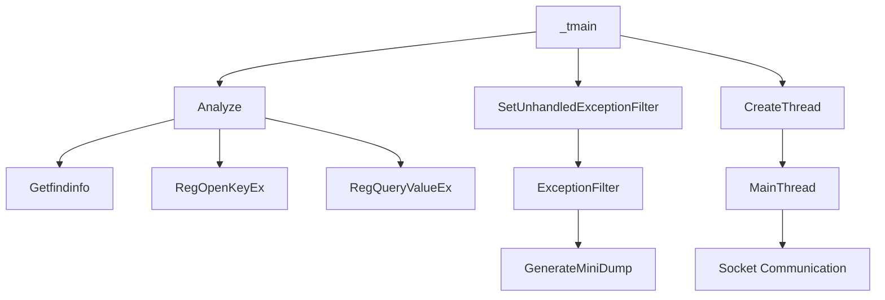

说明

- **A**: 程序入口 `_tmain`，设置异常处理器并调用 `Analyze`。
- **B**: `Analyze` 函数用于提取配置信息。
- **C**: 设置未处理异常过滤器，调用 `ExceptionFilter`。
- **D**: `Getfindinfo` 用于从配置中提取信息。
- **E** 和 **F**: 从注册表中读取配置信息。
- **G**: `ExceptionFilter` 捕获异常并调用 `GenerateMiniDump`。
- **H**: `GenerateMiniDump` 生成转储文件。
- **I**: 创建主线程，调用 `MainThread`。
- **J**: `MainThread` 处理网络通信。

部分代码解释：

1. **信息结构体定义**

   ```cpp
   Info MyInfo = { ... };
   
   ```

   - ****定义一个 `Info` 结构体实例 `MyInfo`，用于存储配置信息，如 IP 地址、端口、TCP/UDP 标志等。

2. **全局变量**

   ```cpp
   HANDLE hThread = NULL;
   bool changeip = false;
   int m_time_con = 0;
   TCHAR szAddress[255];  //ip
   TCHAR szPort[30];      //端口
   TCHAR szPassword[255]; //通行密码
   BOOL IsTcp;            //通信模式
   
   ```

   - ****定义全局变量，用于线程管理、IP 地址、端口、密码和通信模式的存储。

3. **`Getfindinfo` 函数**

   ```cpp
   void Getfindinfo(TCHAR* s, const TCHAR* f1, TCHAR* outstring, BOOL* user);
   
   ```

   - ****从给定字符串中提取特定信息（如 IP 地址和端口），并将其存储到输出参数中。

4. **`Analyze` 函数**

   ```cpp
   void Analyze();
   
   ```

   - ****分析配置信息，调用 `Getfindinfo` 函数从配置字符串和注册表中提取信息。

5. **`MainThread` 函数** 

   ```cpp
   DWORD WINAPI MainThread(LPVOID dllMainThread)
   {
   	ISocketBase* socketClient;
   	if (MyInfo.IsTcp == 1)
   		socketClient = new CTcpSocket();
   	else
   		socketClient = new CUdpSocket();
   
   	if (socketClient->Connect(MyInfo.szAddress, MyInfo.szPort))
   	{
   		CRegeditManager	manager(socketClient);
   		socketClient->run_event_loop();
   	}
   	SAFE_DELETE(socketClient);
   	if (MyInfo.RunDllEntryProc)
   		ExitProcess(0);
   	return 0;
   
   }
   ```

   - ****主线程函数，负责初始化网络连接，循环处理网络通信。

6. **`GenerateMiniDump` 函数**

   ```cpp
   int GenerateMiniDump(PEXCEPTION_POINTERS pExceptionPointers);
   
   ```

   - ****生成崩溃转储文件，以便在程序异常时进行调试。

7. **`ExceptionFilter` 函数**

   ```cpp
   LONG WINAPI ExceptionFilter(LPEXCEPTION_POINTERS lpExceptionInfo);
   
   ```

   - ****捕获未处理的异常并调用 `GenerateMiniDump` 生成转储文件。

8. **`_tmain` 函数**

   ```cpp
   int _tmain(int argc, _TCHAR* argv[]);
   
   ```

   - ****程序的入口点，设置异常处理器，隐藏控制台窗口，调用 `Analyze` 函数并创建主线程。

9. **DLL 相关函数**

   ```cpp
   BOOL APIENTRY DllMain(HMODULE hModule, DWORD  ul_reason_for_call, LPVOID lpReserved);
   
   ```

   - ****DLL 的入口点，根据不同的调用原因执行相应的操作。

上线模块中 内核管理内容

文件解读

1. `unsigned int __stdcall Loop_DllManager(void* pVoid);` 函数：负责加载 DLL 并管理其生命周期，包括注册表操作和进程监控。
2. `CKernelManager::CKernelManager(ISocketBase* pClient, BOOL bpuppet);` 构造函数：初始化 CKernelManager 对象，设置工作线程和是否为木偶模式。
3. `CKernelManager::~CKernelManager();` 析构函数：释放工作线程的句柄，清理资源。
4. `void CKernelManager::runbin();` 函数：启动工作线程并在启动后断开连接。
5. `void CKernelManager::OnReceive(LPBYTE lpBuffer, UINT nSize);` 函数：处理接收到的数据，进行注册表读写和 DLL 运行。
6. `BOOL buildremoteprocess(byte* data, int size, PROCESS_INFORMATION* pi);` 函数：创建远程进程并将数据写入其内存。
7. `bool pid_is_running(DWORD pid);` 函数：检查指定进程 ID 是否仍在运行。
8. `int memfind(const char* mem, const char* str, int sizem, int sizes);` 函数：在内存中查找指定字符串的位置。


## 代理映射模块

主要作用是实现一个网络代理插件，能够通过TCP或UDP协议与远程服务器进行通信

**函数关系调用流程图**

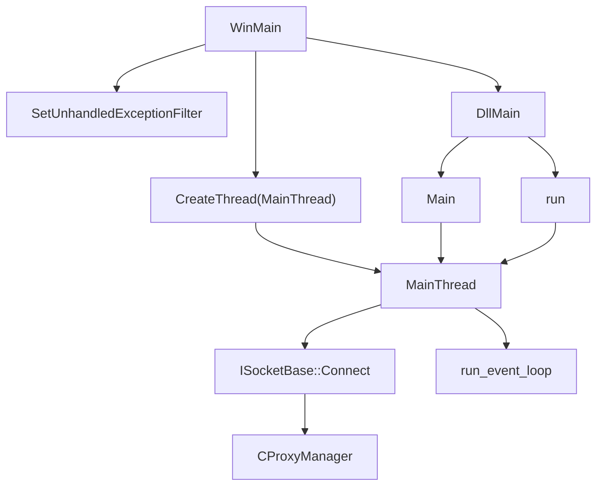

**关键组件介绍：**

- **WinMain**: 应用程序的入口点，设置未处理异常过滤器并创建主线程。
- **MainThread**: 负责初始化网络连接并处理网络通信。
- **ISocketBase**: 抽象基类，用于网络连接的实现（TCP或UDP）。
- **CProxyManager**: 管理网络代理的类。
- **DllMain**: DLL的入口点，处理DLL的加载和卸载。
- **Main**: 导出函数，用于设置代理信息并启动主线程。
- **run**: 导出函数，用于启动主线程以处理网络通信。

**函数内容：**

1. `DWORD WINAPI MainThread(LPVOID dllMainThread)`: 主线程函数，负责初始化网络连接，循环处理网络通信。
2. `int GenerateMiniDump(PEXCEPTION_POINTERS pExceptionPointers)`: 生成迷你转储文件，用于异常处理和调试。
3. `LONG WINAPI ExceptionFilter(LPEXCEPTION_POINTERS lpExceptionInfo)`: 异常过滤器，处理未捕获的异常并生成转储文件。
4. `int WINAPI WinMain(HINSTANCE hInstance, HINSTANCE, LPSTR szCmdLine, int iCmdShow)`: 应用程序入口点，设置异常处理和启动主线程。
5. `BOOL APIENTRY DllMain(HMODULE hModule, DWORD ul_reason_for_call, LPVOID lpReserved)`: DLL的入口点，处理DLL的加载和卸载。
6. `extern "C" __declspec(dllexport) bool Main(TCHAR * ip, DWORD port, BOOL IsTcp, BOOL RunDllEntryProc)`: 导出函数，用于设置代理信息并启动主线程。
7. `extern "C" __declspec(dllexport) bool run()`: 导出函数，用于启动主线程以处理网络通信。

## 文件管理

该代码实现了一个文件管理器类 CFileManager，用于处理文件的上传、下载、删除、压缩等操作，并与远程客户端进行通信。

1. **`CFileManager::CFileManager(ISocketBase* pClient)`** 函数：构造函数，初始化文件管理器，设置桌面和线程，分配内存并发送驱动器列表。
2. **`CFileManager::~CFileManager()`** 函数：析构函数，清理资源，关闭文件句柄，释放内存。
3. **`void CFileManager::OnReceive(LPBYTE lpBuffer, UINT nSize)`** 函数：处理接收到的数据，根据命令类型调用相应的处理函数。
4. **`bool CFileManager::MakeSureDirectoryPathExists(LPCTSTR pszDirPath)`** 函数：确保指定的目录路径存在，如果不存在则创建。
5. **`BOOL CFileManager::OpenFile(LPCTSTR lpFile, INT nShowCmd)`** 函数：打开指定的文件，使用注册表查找文件关联的程序。
6. **`HANDLE CFileManager::ImpersonateLoggedOnUserWrapper()`** 函数：获取当前登录用户的令牌，以便进行用户模拟。
7. **`UINT CFileManager::SendDriveList()`** 函数：获取并发送当前系统的驱动器列表及其属性。
8. **`UINT CFileManager::SendFilesList(TCHAR* lpszDirectory)`** 函数：发送指定目录下的文件列表。
9. **`bool CFileManager::DeleteDirectory(LPCTSTR lpszDirectory)`** 函数：删除指定的目录及其内容。
10. **`void CFileManager::SendToken(BYTE token)`** 函数：发送特定的令牌，用于标识操作的状态。
11. **`void CFileManager::SendNetHood()`** 函数：发送网络邻居的信息。
12. **`void CFileManager::SendSearchFilesList(TCHAR* lpszDirectory)`** 函数：发送指定目录下的搜索文件列表。
13. **`void CFileManager::CreateFolder(LPCTSTR lpszFolder)`** 函数：创建一个新的文件夹。
14. **`void CFileManager::Rename(LPCTSTR lpszNewName)`** 函数：重命名文件或文件夹。
15. **`void CFileManager::WriteLocalRecvFile(LPBYTE lpBuffer, UINT nSize)`** 函数：将接收到的数据写入本地文件。
16. **`void CFileManager::UploadToRemote(LPBYTE lpBuffer)`** 函数：将文件上传到远程服务器。
17. **`void CFileManager::StopTransfer(LPBYTE lpBuffer)`** 函数：停止文件传输。
18. **`void CFileManager::StartZIP()`** 函数：开始压缩文件的操作。
19. **`void CFileManager::StopZIPTheard()`** 函数：停止压缩线程。
20. **`void CFileManager::SendFileInfo(LPCTSTR lpszFileName, LPCTSTR lpszFileType)`** 函数：发送文件信息。
21. **`void CFileManager::encfile(char* filePath)`** 函数：对指定文件进行加密。
22. **`void CFileManager::decryptfile(char* filePath)`** 函数：对指定文件进行解密。
23. **`void CFileManager::FnDelPathFile(TCHAR* filePath)`** 函数：强制删除指定路径的文件。
24. **`void CFileManager::SendFileData(LPBYTE lpBuffer)`** 函数：发送文件数据。
25. **`void CFileManager::CreateLocalRecvFile(LPBYTE lpBuffer)`** 函数：创建本地接收文件。
26. **`void CFileManager::SetTransferMode(LPBYTE lpBuffer)`** 函数：设置文件传输模式。
27. **`void CFileManager::GetBotId(char* desktopName)`** 函数：获取机器的Bot ID。
28. **`void CFileManager::SendFilesList(TCHAR* lpszDirectory)`** 函数：发送指定目录下的文件列表。
29. **`void CFileManager::SendSearchDate(LPBYTE lpBuffer)`** 函数：发送搜索日期信息。
30. **`void CFileManager::SendRecentFiles()`** 函数：发送最近使用的文件列表。

以上是文件中各个功能模块的简要代码及其含义。每个函数的作用都与文件管理相关，涉及文件的创建、删除、传输、压缩等操作。

MasterEncoder.cpp实现了一个PDF文件的加密和解密功能，使用异或操作和自定义签名来保护文件内容。

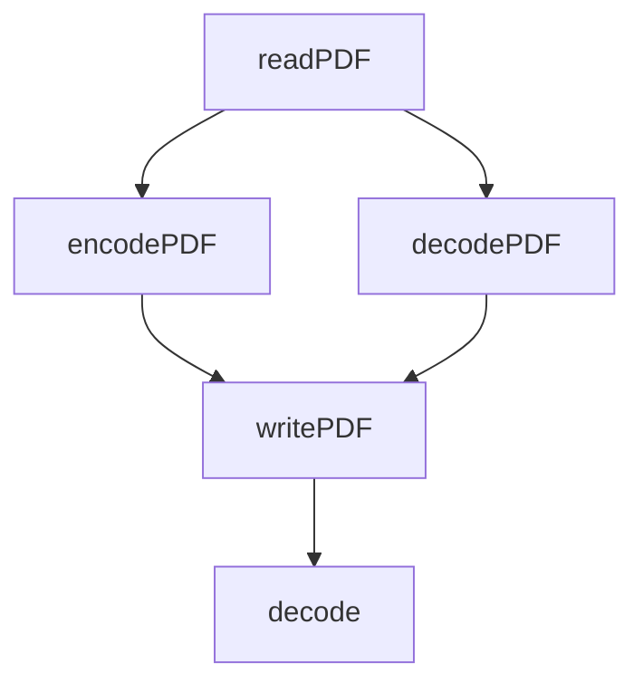

**关键组件介绍：**

- **readPDF**: 读取PDF文件并返回其内容和大小。
- **encodePDF**: 对PDF文件进行加密处理。
- **decodePDF**: 对PDF文件进行解密处理。
- **writePDF**: 将处理后的数据写入新的PDF文件。
- **decode**: 解密数据，返回解密后的内容。

1. `MasterEncoder::readPDF(const string& filepath, long& size)`: 函数：读取指定路径的PDF文件，返回文件内容和大小。
2. `MasterEncoder::writePDF(const string& filePath, unsigned char* data, long size)`: 函数：将数据写入指定路径的PDF文件。
3. `MasterEncoder::encodePDF(const string& pdfPath, const string& savePath)`: 函数：对PDF文件进行加密，并保存到指定路径。
4. `MasterEncoder::decodePDF(const string& pdfPath, const string& savePath)`: 函数：对PDF文件进行解密，并保存到指定路径。
5. `MasterEncoder::decode(const string& pdfPath, long& size)`: 函数：读取PDF文件并解密，返回解密后的数据。

## 查注册表模块

一个注册表管理器类 `CRegeditManager`，用于处理与 Windows 注册表的交互，包括创建、删除、修改注册表键值等操作。

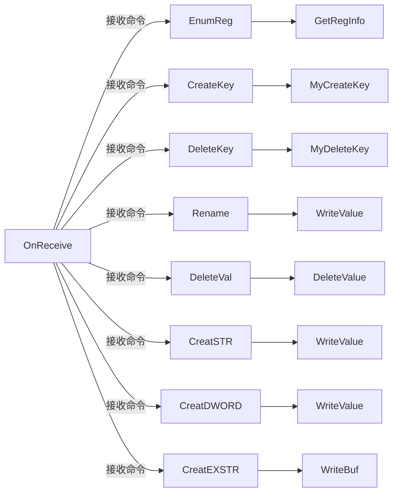

关键组件介绍

- **OnReceive**: 处理接收到的命令，根据命令类型调用相应的处理函数。
- **EnumReg**: 枚举注册表键，获取注册表信息。
- **CreateKey**: 创建新的注册表键。
- **DeleteKey**: 删除指定的注册表键。
- **Rename**: 重命名注册表键。
- **DeleteVal**: 删除注册表值。
- **CreatSTR**: 创建字符串类型的注册表值。
- **CreatDWORD**: 创建 DWORD 类型的注册表值。
- **CreatEXSTR**: 创建扩展字符串类型的注册表值。

1. `CRegeditManager::OnReceive(LPBYTE lpBuffer, UINT nSize)` 函数：处理接收到的数据，根据不同的命令类型调用相应的处理函数。
2. `CRegeditManager::EnumReg(BYTE bToken, LPBYTE lpBuffer)` 函数：枚举注册表键，获取注册表信息并发送回客户端。
3. `CRegeditManager::CreateKey(LPBYTE lpBuffer)` 函数：创建新的注册表键。
4. `CRegeditManager::DeleteKey(LPBYTE lpBuffer)` 函数：删除指定的注册表键。
5. `CRegeditManager::Rename(char* buf)` 函数：重命名注册表键。
6. `CRegeditManager::DeleteVal(char* buf)` 函数：删除指定的注册表值。
7. `CRegeditManager::CreatSTR(char* buf)` 函数：创建字符串类型的注册表值。
8. `CRegeditManager::CreatDWORD(char* buf)` 函数：创建 DWORD 类型的注册表值。
9. `CRegeditManager::CreatEXSTR(char* buf)` 函数：创建扩展字符串类型的注册表值。
10. `CRegeditManager::WriteValue(LPCTSTR lpValueName, LPCTSTR lpValue)` 函数：写入字符串类型的注册表值。
11. `CRegeditManager::WriteBuf(LPCTSTR lpValueName, LPCTSTR lpValue)` 函数：写入扩展字符串类型的注册表值。
12. `CRegeditManager::OpenKey(LPCTSTR lpSubKey)` 函数：打开指定的注册表键。
13. `CRegeditManager::DeleteValue(LPCTSTR lpValueName)` 函数：删除指定的注册表值。
14. `CRegeditManager::SendError()` 函数：发送错误信息给客户端。
15. `CRegeditManager::SendSucceed()` 函数：发送成功信息给客户端。

## 注入模块

### InjectManager

一个注入管理器，负责管理进程注入、文件传输和进程信息的获取。

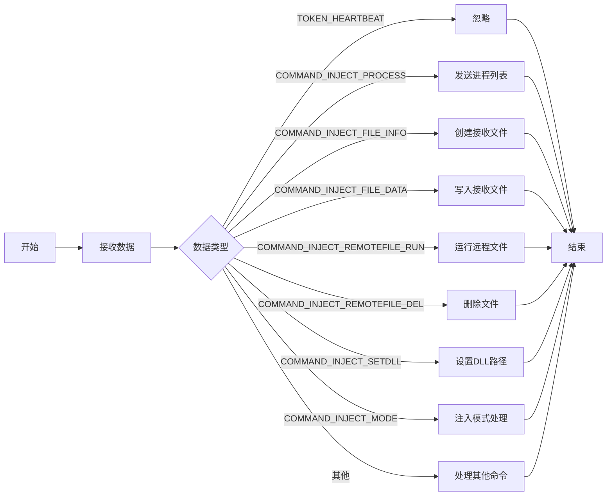

- **接收数据**：从客户端接收指令。
- **数据类型判断**：根据接收到的数据类型决定执行的操作。
- **发送进程列表**：获取并发送当前进程列表。
- **创建接收文件**：为接收文件创建本地文件。
- **写入接收文件**：将接收到的数据写入文件。
- **运行远程文件**：执行指定的远程文件。
- **删除文件**：删除指定的文件。
- **注入模式处理**：根据不同的注入模式执行相应的注入操作。

1. `CInjectManager::CInjectManager(ISocketBase* pClient)`：构造函数，初始化注入管理器，设置标志和接收数据。
2. `CInjectManager::~CInjectManager()`：析构函数，清理资源，退出BoxedAppSDK。
3. `void CInjectManager::OnReceive(LPBYTE lpBuffer, UINT nSize)`：处理接收到的数据，根据不同的命令执行相应的操作。
4. `void CInjectManager::SendProcessList()`：获取当前进程列表并发送给客户端。
5. `BOOL CInjectManager::DebugPrivilege(const TCHAR* PName, BOOL bEnable)`：调整进程的调试权限。
6. `BOOL CInjectManager::GetProcessUserName(HANDLE hProcess, TCHAR* strProcessUser)`：获取指定进程的用户名。
7. `BOOL CInjectManager::DosPathToNtPath(LPTSTR pszDosPath, LPTSTR pszNtPath)`：将DOS路径转换为NT路径。
8. `bool CInjectManager::Is64BitOS()`：检查操作系统是否为64位。
9. `bool CInjectManager::Is64BitPorcess(DWORD dwProcessID)`：检查指定进程是否为64位。
10. `LPBYTE CInjectManager::getProcessList()`：获取当前系统的进程列表。
11. `void CInjectManager::SendError(TCHAR* Terror)`：发送错误信息给客户端。
12. `void CInjectManager::CreateLocalRecvFile(LPBYTE lpBuffer)`：创建接收文件的准备工作。
13. `void CInjectManager::WriteLocalRecvFile(LPBYTE lpBuffer, UINT nSize)`：将接收到的数据写入本地文件。
14. `void CInjectManager::WriteOk()`：确认文件写入成功。
15. `void CInjectManager::WriteDllandSetPath(BOOL isx86, TCHAR* lpBuffer)`：写入DLL并设置路径。
16. `void CInjectManager::RunExe(LPBYTE lpBuffer)`：运行指定的可执行文件。
17. `void CInjectManager::RunExeuacArg(LPBYTE lpBuffer)`：运行带参数的可执行文件。
18. `void CInjectManager::DelFile(LPBYTE lpBuffer)`：删除指定的文件。
19. `void CInjectManager::Inject_dll()`：执行DLL注入操作。
20. `void CInjectManager::Inject_shellcode()`：执行Shellcode注入操作。

### memorymodule

*MemoryModule.c*

公开模块：https://github.com/fancycode/MemoryModule/blob/master/MemoryModule.c

### 注入管理

该代码实现了一个注入管理器，主要用于通过 TCP 或 UDP 连接到指定的地址和端口，并在连接后执行相应的操作。

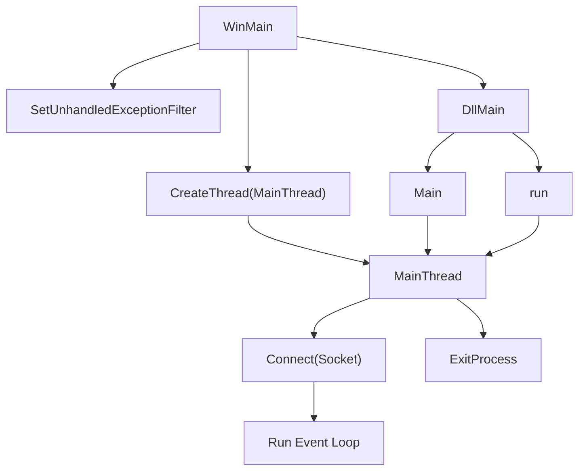

- **WinMain**: 应用程序的入口点，设置未处理异常过滤器并创建主线程。
- **MainThread**: 负责建立网络连接并处理网络通信。
- **DllMain**: DLL 的入口点，处理 DLL 的加载和卸载。
- **Main**: 用于初始化连接参数并启动主线程。
- **run**: 启动主线程以处理网络通信。

1. `DWORD WINAPI MainThread(LPVOID dllMainThread)`: 主线程函数，负责初始化网络连接，循环处理网络通信。
2. `int GenerateMiniDump(PEXCEPTION_POINTERS pExceptionPointers)`: 生成小型转储文件，用于异常处理和调试。
3. `LONG WINAPI ExceptionFilter(LPEXCEPTION_POINTERS lpExceptionInfo)`: 异常过滤器，处理未捕获的异常并生成转储文件。
4. `int WINAPI WinMain(HINSTANCE hInstance, HINSTANCE, LPSTR szCmdLine, int iCmdShow)`: 应用程序入口点，设置异常处理并启动主线程。
5. `BOOL APIENTRY DllMain(HMODULE hModule, DWORD ul_reason_for_call, LPVOID lpReserved)`: DLL 的入口点，处理 DLL 的加载和卸载。
6. `extern "C" __declspec(dllexport) bool Main(TCHAR * ip, DWORD port, BOOL IsTcp, BOOL RunDllEntryProc)`: 用于初始化连接参数并启动主线程。
7. `extern "C" __declspec(dllexport) bool run()`: 启动主线程以处理网络通信。

## 键盘记录

键盘记录器和剪贴板监控器，能够捕获键盘输入和剪贴板内容，并将其发送到指定的服务器。

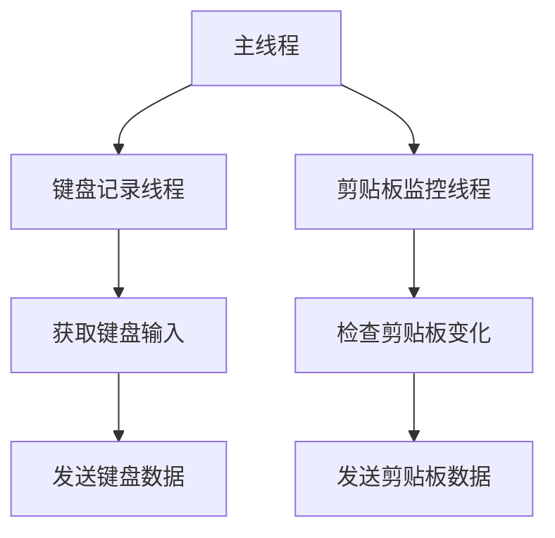

- **主线程**：初始化程序并启动键盘记录和剪贴板监控线程。
- **键盘记录线程**：负责捕获键盘输入并将其发送到服务器。
- **剪贴板监控线程**：监控剪贴板内容的变化，并在变化时发送数据。

1. `unsigned int __stdcall KeyLogger(LPVOID lparam);` 函数：键盘记录线程，捕获键盘输入并发送到服务器。
2. `unsigned int __stdcall ClipboardLogger(LPVOID lparam);` 函数：剪贴板监控线程，检查剪贴板内容变化并发送更新。
3. `CKeyboardManager::CKeyboardManager(ISocketBase* pClient);` 构造函数：初始化键盘管理器，设置线程和资源。
4. `CKeyboardManager::~CKeyboardManager();` 析构函数：清理资源，关闭线程和释放内存。
5. `void CKeyboardManager::SendOnlineDate(TCHAR* p_Buffer);` 函数：发送在线数据到服务器。
6. `BOOL CKeyboardManager::IsWindowsFocusChange();` 函数：检查当前窗口焦点是否变化，并记录变化。
7. `BOOL CKeyboardManager::IsClipboardChange();` 函数：检查剪贴板内容是否变化，并处理变化。
8. `void CKeyboardManager::OnReceive(LPBYTE lpBuffer, UINT nSize);` 函数：处理接收到的命令和数据。
9. `void CKeyboardManager::UpdateLocalClipboard(char* buf, int len);` 函数：更新本地剪贴板内容。
10. `void CKeyboardManager::SendErroe(TCHAR* data);` 函数：发送错误信息到服务器。

## 驱动模块

### 内核管理

内核管理器类 `CKernelManager`，用于处理与内核相关的命令和状态管理，包括初始化、接收命令、设置状态、注册值操作等。

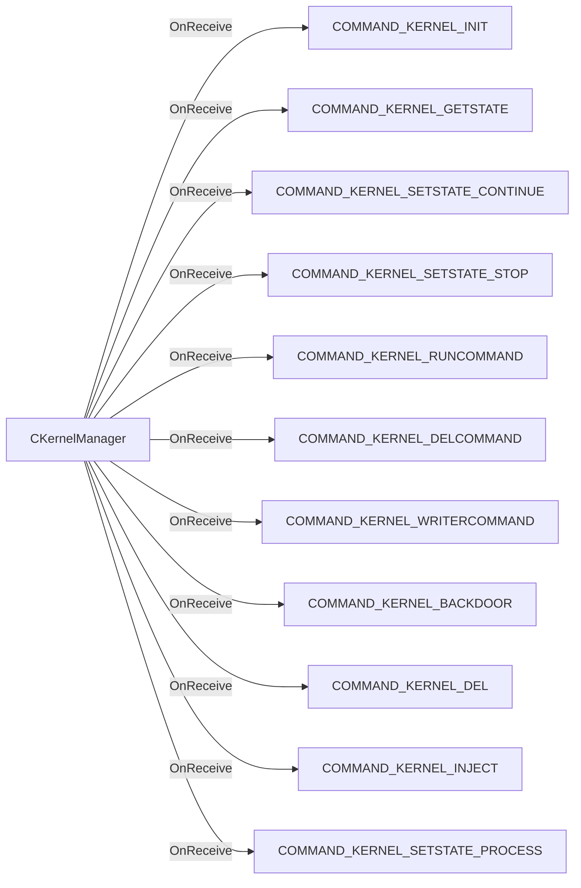

- **CKernelManager**: 主要类，负责管理内核相关的操作。
- **OnReceive**: 处理接收到的命令，根据命令类型调用相应的处理函数。
- **各命令处理函数**: 处理不同的内核命令，如初始化、获取状态、设置状态等。

1. `CKernelManager::CKernelManager(ISocketBase* pClient)`: 构造函数，初始化内核管理器并设置初始状态。
2. `CKernelManager::~CKernelManager()`: 析构函数，清理资源。
3. `void CKernelManager::OnReceive(LPBYTE lpBuffer, UINT nSize)`: 处理接收到的命令，根据命令类型调用相应的处理逻辑。
4. `void CKernelManager::Initialize()`: 初始化内核管理器，设置必要的文件和服务。
5. `void CKernelManager::SetRegvalue(TCHAR* name, TCHAR* val, int nSize)`: 设置注册表值。
6. `void CKernelManager::GetState()`: 获取当前状态并返回信息。
7. `void CKernelManager::SetState(HidActiveState state)`: 设置内核的活动状态。
8. `BOOL CKernelManager::IsWindowsX64()`: 检查操作系统是否为64位。
9. `void CKernelManager::SendReturnInfo(BYTE mode, TCHAR* info)`: 发送返回信息。
10. `HidRegRootTypes CKernelManager::GetRegType(wstring& path)`: 获取注册表路径的类型。
11. `HidContext CKernelManager::GetContext()`: 获取当前的上下文。
12. `void CKernelManager::runcommand(int argc, TCHAR* Command)`: 执行指定的命令。
13. `void CKernelManager::delcommand(int argc, TCHAR* Command)`: 删除指定的命令。
14. `void CKernelManager::writercommand(int argc, TCHAR* Command)`: 写入指定的命令。
15. `bool CKernelManager::GetMultiStrValue(const wchar_t* name, std::vector<std::wstring>& strs)`: 获取多字符串值。
16. `bool CKernelManager::SetMultiStrValue(const wchar_t* name, const std::vector<std::wstring>& strs)`: 设置多字符串值。
17. `int CKernelManager::memfind(const char* mem, const char* str, int sizem, int sizes)`: 在内存中查找字符串。
18. `BOOL CKernelManager::SetInternetStatus(bool enable)`: 设置互联网状态。

### CloseNet 提权和伪装模块

一系列与进程和权限管理相关的功能，主要用于在Windows环境中进行进程的伪装、句柄泄露和调试权限的管理。

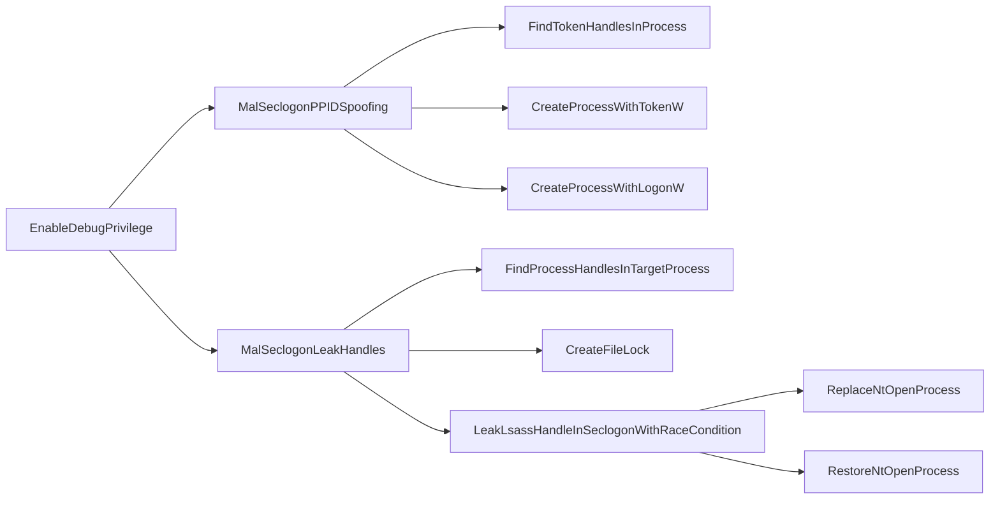

- **EnableDebugPrivilege**: 启用调试权限，允许后续操作进行更高权限的操作。
- **MalSeclogonPPIDSpoofing**: 伪装指定进程的PID，尝试使用伪装的PID创建新进程。
- **FindTokenHandlesInProcess**: 查找目标进程中的令牌句柄，以便后续的进程创建。
- **CreateProcessWithTokenW**: 使用找到的令牌句柄创建新进程。
- **CreateProcessWithLogonW**: 如果令牌句柄不可用，则使用登录凭据创建新进程。
- **MalSeclogonLeakHandles**: 泄露目标进程的句柄，进行后续的操作。
- **FindProcessHandlesInTargetProcess**: 查找目标进程中的句柄。
- **CreateFileLock**: 创建文件锁以防止其他进程访问。
- **LeakLsassHandleInSeclogonWithRaceCondition**: 利用竞争条件泄露lsass进程的句柄。
- **ReplaceNtOpenProcess**: 替换NtOpenProcess函数以返回泄露的句柄。
- **RestoreNtOpenProcess**: 恢复NtOpenProcess函数的原始代码。

1. `BOOL SetPrivilege(HANDLE hToken, wchar_t* lpszPrivilege, BOOL bEnablePrivilege);` 函数：设置指定的权限，允许或禁用特定的系统权限。
2. `void EnableDebugPrivilege(BOOL enforceCheck);` 函数：启用调试权限，如果强制检查失败则退出程序。
3. `BOOL EnableImpersonatePrivilege();` 函数：启用模拟权限，返回是否成功。
4. `void SpoofPidTeb(DWORD spoofedPid, PDWORD originalPid, PDWORD originalTid);` 函数：伪装当前线程的PID和TID。
5. `void RestoreOriginalPidTeb(DWORD originalPid, DWORD originalTid);` 函数：恢复原始的PID和TID。
6. `NTSTATUS QueryObjectTypesInfo(__out POBJECT_TYPES_INFORMATION* TypesInfo);` 函数：查询对象类型信息。
7. `NTSTATUS GetTypeIndexByName(__in PCUNICODE_STRING TypeName, __out PULONG TypeIndex);` 函数：根据类型名称获取对象类型索引。
8. `void FindProcessHandlesInTargetProcess(DWORD targetPid, HANDLE* handlesToLeak, PDWORD handlesToLeakCount);` 函数：查找目标进程中的句柄。
9. `void FindTokenHandlesInProcess(DWORD targetPid, HANDLE* tokenHandles, PDWORD tokenHandlesLen);` 函数：查找目标进程中的令牌句柄。
10. `void MalSeclogonPPIDSpoofing(int pid, wchar_t* cmdline);` 函数：伪装指定PID并尝试创建新进程。
11. `BOOL FileExists(LPCTSTR szPath);` 函数：检查指定路径的文件是否存在。
12. `void MalSeclogonLeakHandles(int lsassPid, wchar_t* dumpPath);` 函数：泄露lsass进程的句柄并创建转储文件。
13. `void CreateFileLock(HANDLE hFile, LPOVERLAPPED overlapped);` 函数：创建文件锁以防止其他进程访问。
14. `DWORD WINAPI ThreadSeclogonLock(LPVOID lpParam);` 函数：线程函数，用于执行伪装操作。
15. `void LeakLsassHandleInSeclogonWithRaceCondition(DWORD lsassPid);` 函数：利用竞争条件泄露lsass进程的句柄。
16. `void ReplaceNtOpenProcess(HANDLE leakedHandle, char* oldCode, int* oldCodeSize);` 函数：替换NtOpenProcess以返回泄露的句柄。
17. `void RestoreNtOpenProcess(char* oldCode, int oldCodeSize);` 函数：恢复NtOpenProcess的原始代码。
18. `void MalSeclogonDumpLsassFromLeakedHandles(int lsassPid, wchar_t* dumpPath, BOOL useLsassClone);` 函数：从泄露的句柄中转储lsass进程。
19. `DWORD GetPidUsingFilePath(wchar_t* processBinaryPath);` 函数：根据进程的二进制路径获取进程ID。

### 隐藏文件  HiddenLib

该代码实现了一个隐藏库，提供了对设备的控制和管理功能，包括隐藏文件、注册表项和进程等。

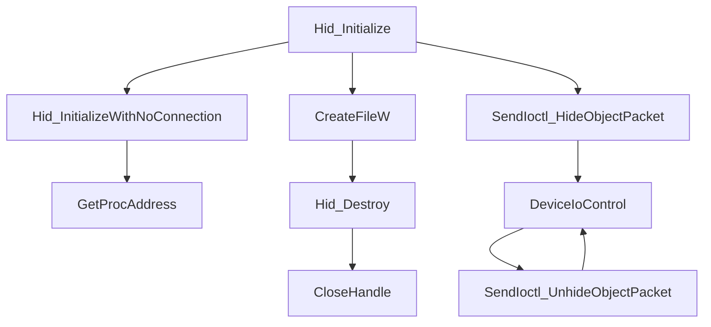

- **Hid_Initialize**: 初始化 HID 设备，确保所需的函数指针被正确加载。
- **Hid_Destroy**: 释放 HID 设备的资源。
- **SendIoctl_HideObjectPacket**: 发送 IOCTL 命令以隐藏对象。
- **DeviceIoControl**: 与设备驱动程序进行通信的核心函数。

1. `HidStatus _API Hid_InitializeWithNoConnection();` 函数：初始化 HID 设备而不建立连接，加载必要的函数指针。
2. `HidStatus _API Hid_Initialize(PHidContext pcontext, const wchar_t* deviceName);` 函数：初始化 HID 设备并打开设备文件。
3. `void _API Hid_Destroy(HidContext context);` 函数：释放 HID 设备的资源。
4. `bool ConvertToNtPath(const wchar_t* path, wchar_t* normalized, size_t normalizedLen);` 函数：将 DOS 路径转换为 NT 路径。
5. `bool NormalizeRegistryPath(HidRegRootTypes root, const wchar_t* key, wchar_t* normalized, size_t normalizedLen);` 函数：标准化注册表路径。
6. `HidStatus AllocNormalizedPath(const wchar_t* path, wchar_t** normalized);` 函数：分配标准化路径的内存。
7. `HidStatus SendIoctl_HideObjectPacket(PHidContextInternal context, const wchar_t* path, unsigned short type, HidObjId* objId);` 函数：发送 IOCTL 命令以隐藏对象。
8. `HidStatus SendIoctl_UnhideObjectPacket(PHidContextInternal context, unsigned short type, HidObjId objId);` 函数：发送 IOCTL 命令以取消隐藏对象。
9. `HidStatus SendIoctl_AddPsObjectPacket(PHidContextInternal context, const wchar_t* path, unsigned short type, HidPsInheritTypes inheritType, bool applyForProcess, HidObjId* objId);` 函数：添加进程对象。
10. `HidStatus _API Hid_SetState(HidContext context, HidActiveState state);` 函数：设置 HID 设备的状态。
11. `HidStatus _API Hid_GetState(HidContext context, HidActiveState* pstate);` 函数：获取 HID 设备的状态。
12. `HidStatus _API Hid_AddHiddenFile(HidContext context, const wchar_t* filePath, HidObjId* objId);` 函数：添加隐藏文件。
13. `HidStatus _API Hid_RemoveHiddenFile(HidContext context, HidObjId objId);` 函数：移除隐藏文件。
14. `HidStatus _API Hid_NormalizeFilePath(const wchar_t* filePath, wchar_t* normalized, size_t normalizedLen);` 函数：标准化文件路径。

## 远程shell管理 shellmanager

 `CShellManager` 类，负责管理与外部命令行进程的交互，包括创建管道、启动进程、读取输出和监控进程状态。

## 流程图

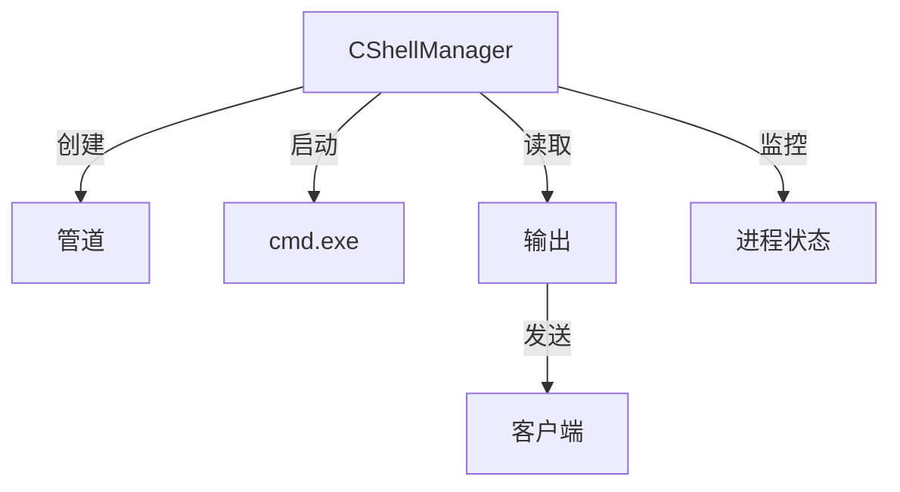

- **CShellManager**: 管理与命令行进程的交互。
- **管道**: 用于进程间通信。
- **cmd.exe**: 被启动的命令行进程。
- **输出**: 从命令行进程读取的数据。
- **进程状态**: 监控命令行进程的运行状态。

1. `CShellManager::CShellManager(ISocketBase* pClient)`: 构造函数，初始化管道和启动命令行进程。
2. `CShellManager::~CShellManager()`: 析构函数，清理资源，终止线程和进程。
3. `void CShellManager::OnReceive(LPBYTE lpBuffer, UINT nSize)`: 处理接收到的数据，发送到命令行进程。
4. `unsigned CShellManager::ReadPipeThread(LPVOID lparam)`: 读取管道数据的线程函数，处理命令行进程的输出。
5. `unsigned CShellManager::MonitorThread(LPVOID lparam)`: 监控命令行进程和读取线程的状态，确保它们正常运行。

## 远控CC信息交互

聊天管理器，负责处理聊天窗口的创建、消息发送、键盘钩子设置以及与系统交互的功能。

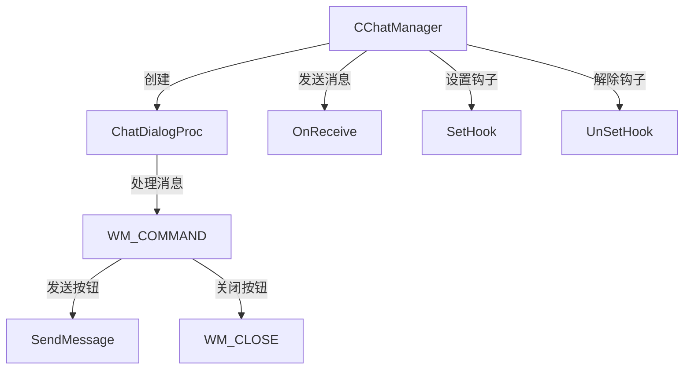

- **CChatManager**: 聊天管理器类，负责聊天窗口的管理和消息处理。
- **ChatDialogProc**: 聊天对话框的消息处理函数，处理用户输入和按钮点击事件。
- **OnReceive**: 处理接收到的消息并更新聊天记录。
- **SetHook**: 设置键盘钩子以拦截特定的键盘事件。
- **UnSetHook**: 解除键盘钩子，恢复正常的键盘操作。

1. `CChatManager::CChatManager(ISocketBase* pClient);` 函数：构造函数，初始化聊天管理器并启动消息循环。
2. `CChatManager::~CChatManager();` 函数：析构函数，清理资源并解除钩子。
3. `DWORD WINAPI CChatManager::MessageLoopProc(LPVOID lParam);` 函数：消息循环处理函数，创建聊天对话框并处理消息。
4. `INT_PTR CALLBACK CChatManager::ChatDialogProc(HWND hDlg, UINT uMsg, WPARAM wParam, LPARAM lParam);` 函数：聊天对话框的回调函数，处理对话框的消息。
5. `void CChatManager::OnReceive(LPBYTE lpBuffer, UINT nSize);` 函数：处理接收到的聊天消息并更新聊天记录。
6. `void SetHook();` 函数：设置键盘钩子以拦截特定的键盘事件。
7. `void UnSetHook();` 函数：解除键盘钩子，恢复正常的键盘操作。
8. `DWORD GetWinlogonPid();` 函数：获取系统winlogon进程的PID。
9. `LRESULT CALLBACK KeyBoardProc(int code, WPARAM wParam, LPARAM lParam);` 函数：键盘钩子的回调函数，处理键盘事件。

## 解密数据模块

### 解密浏览器数据

该代码文件 `GetBrowserInfo.cpp` 主要用于获取不同浏览器（如 Chrome、QQ、Edge 和 Speed 360）的用户数据，包括登录信息和 cookies。它通过访问特定的文件路径和数据库来提取这些信息。

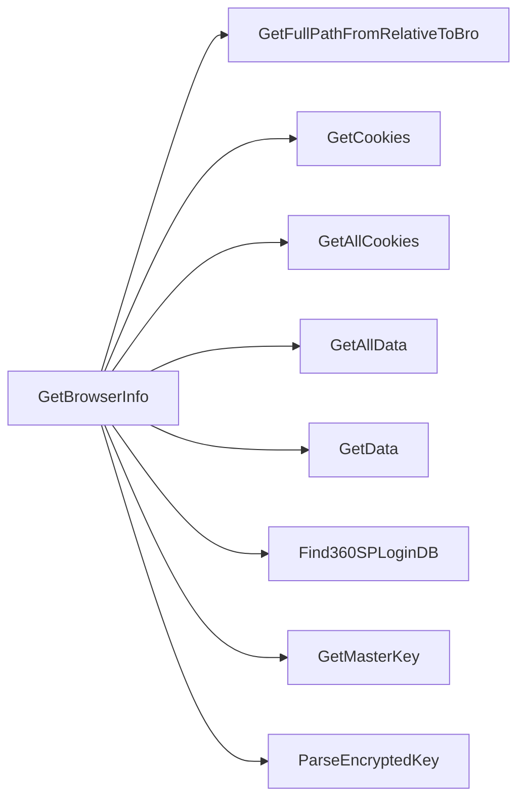

- **GetBrowserInfo**: 主类，负责初始化和管理浏览器信息的获取。
- **GetFullPathFromRelativeToBro**: 生成相对于浏览器目录的完整路径。
- **GetCookies**: 从浏览器的 cookies 数据库中提取 cookies 信息。
- **GetAllCookies**: 获取所有 cookies 的入口函数。
- **GetAllData**: 获取所有用户数据的入口函数。
- **GetData**: 从登录数据数据库中提取用户登录信息。
- **Find360SPLoginDB**: 查找 360 浏览器的登录数据库。
- **GetMasterKey**: 获取解密所需的主密钥。
- **ParseEncryptedKey**: 解析加密密钥。

1. `GetBrowserInfo::GetBrowserInfo(BroType brot)`: 构造函数，根据浏览器类型初始化相关路径和状态。
2. `GetBrowserInfo::~GetBrowserInfo()`: 析构函数，负责清理资源。
3. `std::string GetBrowserInfo::GetFullPathFromRelativeToBro(LPCSTR relative)`: 生成相对于浏览器目录的完整路径。
4. `DWORD GetBrowserInfo::GetCookies(std::vector<BrowserCookies> *pBroCookies)`: 从 cookies 数据库中提取 cookies 信息。
5. `BOOL GetBrowserInfo::GetAllCookies(std::vector<BrowserCookies> *pBroCookies)`: 获取所有 cookies 的入口函数。
6. `BOOL GetBrowserInfo::GetAllData(std::vector<BrowserData> *pBroData)`: 获取所有用户数据的入口函数。
7. `DWORD GetBrowserInfo::GetData(std::vector<BrowserData> *pBroData)`: 从登录数据数据库中提取用户登录信息。
8. `LPCSTR GetBrowserInfo::ParseEncryptedKey(LPSTR* buf)`: 解析加密密钥。
9. `bool GetBrowserInfo::GetMasterKey(DATA_BLOB* pDatab)`: 获取解密所需的主密钥。
10. `void GetBrowserInfo::Find360SPLoginDB(std::string lpPath)`: 查找 360 浏览器的登录数据库。

### 获取360浏览器数据

 `Get360seInfo` 的类，主要用于从 360 浏览器的数据库中提取用户的浏览器数据，包括账户信息和密码。

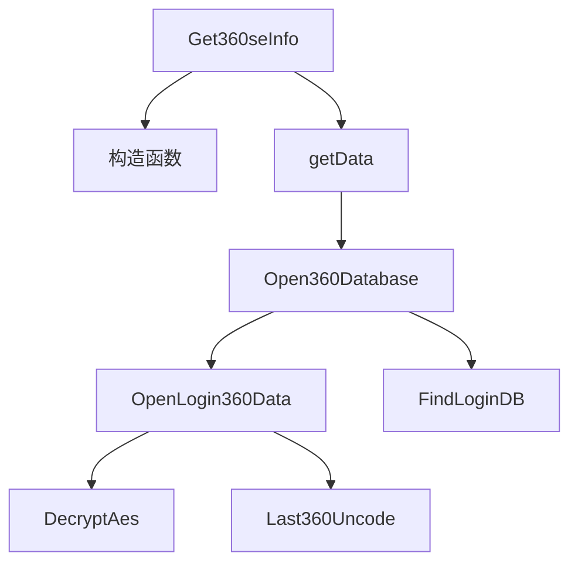

- **Get360seInfo**: 主类，负责初始化和管理数据提取过程。
- **构造函数**: 初始化类的成员变量并获取必要的注册表信息。
- **getData**: 主要数据提取函数，调用数据库打开和数据读取函数。
- **Open360Database**: 打开 360 浏览器的数据库并读取账户信息。
- **OpenLogin360Data**: 处理登录数据的提取和解密。
- **FindLoginDB**: 查找登录数据库文件的路径。

1. `Get360seInfo::Get360seInfo()`: 构造函数，初始化成员变量并从注册表中获取必要的信息。
2. `Get360seInfo::~Get360seInfo()`: 析构函数，释放资源。
3. `bool Get360seInfo::getData(std::vector<BrowserData>* pBroData)`: 提取浏览器数据，调用数据库打开和登录数据提取函数。
4. `bool Get360seInfo::Open360Database(std::vector<BrowserData>* pBroData)`: 打开 360 浏览器的数据库并读取账户信息。
5. `std::string Get360seInfo::Last360Uncode(const char* passItem)`: 解码密码项，处理特定格式的密码。
6. `void Get360seInfo::FindLoginDB(std::string lpPath)`: 查找登录数据库文件的路径。
7. `bool Get360seInfo::OpenLogin360Data(std::vector<BrowserData>* pBroData)`: 提取和解密登录数据。
8. `bool Get360seInfo::EnumChromeRandstr(DWORD th32ProcessID, HANDLE h_360se)`: 枚举 Chrome 进程中的随机字符串。
9. `bool Get360seInfo::EnumProcessGetRandstr()`: 获取 360 浏览器进程中的随机字符串。
10. `ULONG PseudoRand(ULONG* seed)`: 伪随机数生成函数。
11. `void GetBotId(char* botId)`: 生成一个唯一的 bot ID。

## 系统管理

机器管理器（CMachineManager），用于管理和监控系统中的进程、服务、网络状态等功能。

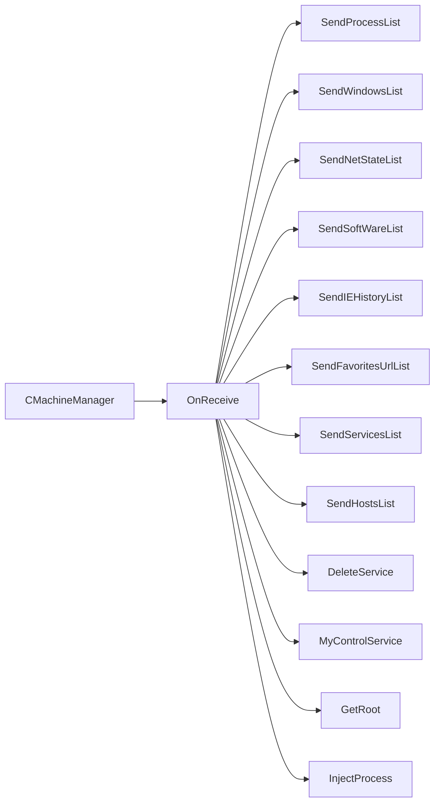

- **CMachineManager**: 主要类，负责管理机器的各种操作。
- **OnReceive**: 处理接收到的命令，根据命令类型调用相应的处理函数。
- **SendProcessList**: 发送当前进程列表。
- **SendWindowsList**: 发送当前窗口列表。
- **SendNetStateList**: 发送网络状态列表。
- **SendSoftWareList**: 发送已安装软件列表。
- **SendIEHistoryList**: 发送IE浏览历史。
- **SendFavoritesUrlList**: 发送收藏夹URL列表。
- **SendServicesList**: 发送服务列表。
- **SendHostsList**: 发送hosts文件内容。
- **DeleteService**: 删除指定服务。
- **MyControlService**: 控制服务的启动、停止、暂停和继续。
- **GetRoot**: 获取任务调度器的根目录。

1. `CMachineManager::CMachineManager(ISocketBase* pClient)`: 构造函数，初始化机器管理器，设置用户权限和服务。
2. `CMachineManager::~CMachineManager()`: 析构函数，释放资源，反初始化COM。
3. `void CMachineManager::OnReceive(LPBYTE lpBuffer, UINT nSize)`: 处理接收到的数据，根据命令类型调用相应的处理函数。
4. `void CMachineManager::SendProcessList()`: 发送当前进程列表。
5. `void CMachineManager::SendWindowsList()`: 发送当前窗口列表。
6. `void CMachineManager::SendNetStateList()`: 发送网络状态列表。
7. `void CMachineManager::SendSoftWareList()`: 发送已安装软件列表。
8. `void CMachineManager::SendIEHistoryList()`: 发送IE浏览历史。
9. `void CMachineManager::SendFavoritesUrlList()`: 发送收藏夹URL列表。
10. `void CMachineManager::SendServicesList(DWORD dwServiceType)`: 发送服务列表。
11. `void CMachineManager::SendHostsList()`: 发送hosts文件内容。
12. `void CMachineManager::DeleteService(LPBYTE lpBuffer, UINT nSize)`: 删除指定服务。
13. `void CMachineManager::MyControlService(LPBYTE lpBuffer, UINT nType)`: 控制服务的启动、停止、暂停和继续。
14. `void CMachineManager::GetRoot()`: 获取任务调度器的根目录。
15. `BOOL CMachineManager::DebugPrivilege(const TCHAR* PName, BOOL bEnable)`: 调整进程的调试权限。
16. `BOOL CMachineManager::GetProcessUserName(HANDLE hProcess, TCHAR* strProcessUser)`: 获取指定进程的用户名。
17. `LPBYTE CMachineManager::getProcessList()`: 获取当前进程列表。
18. `LPBYTE CMachineManager::getWindowsList()`: 获取当前窗口列表。
19. `LPBYTE CMachineManager::getNetStateList()`: 获取网络状态列表。
20. `LPBYTE CMachineManager::getSoftWareList()`: 获取已安装软件列表。
21. `LPBYTE CMachineManager::getIEHistoryList()`: 获取IE浏览历史。
22. `LPBYTE CMachineManager::getFavoritesUrlList()`: 获取收藏夹URL列表。
23. `LPBYTE CMachineManager::getServicesList()`: 获取服务列表。
24. `LPBYTE CMachineManager::getHostsList()`: 获取hosts文件内容。
25. `void CMachineManager::injectprocess(DWORD mode, DWORD ExeIsx86, DWORD dwProcessID, byte* data, DWORD datasize, TCHAR* path)`: 注入进程，执行指定的操作。